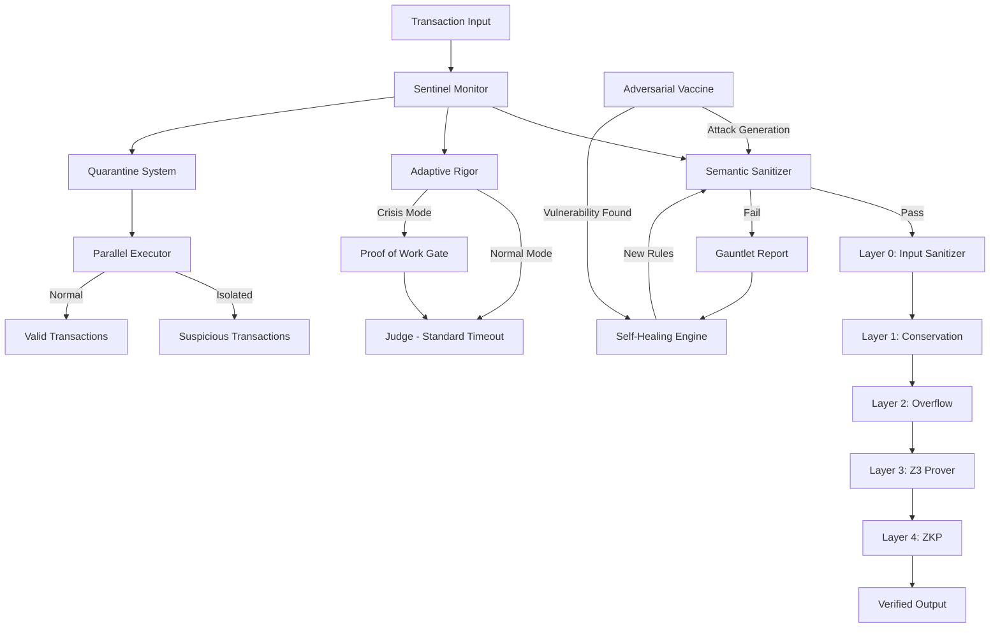
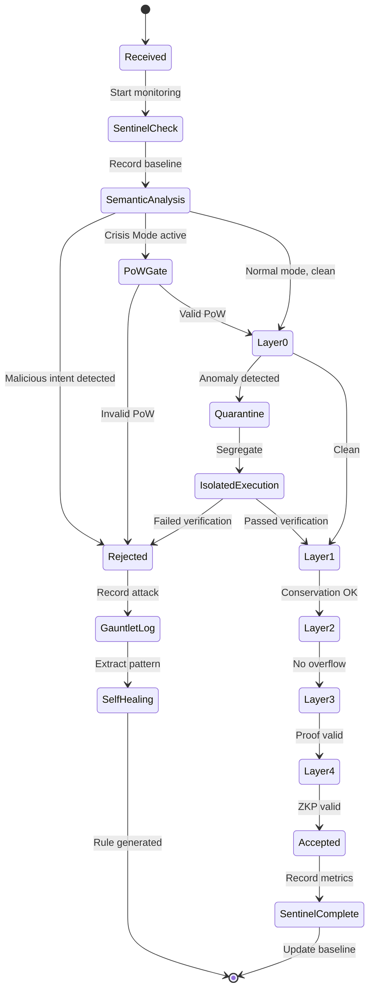

# Design Document: Autonomous Sentinel

## Overview

The Autonomous Sentinel transforms Aethel from a passive fortress into an autonomous self-protecting entity. Inspired by biological immune systems and modern AI defense platforms ([Darktrace](https://www.darktrace.com), [CrowdStrike](https://www.crowdstrike.com)), this system implements four core capabilities:

1. **Threat Detection**: Semantic analysis of code intent using AST pattern recognition
2. **Adaptive Defense**: Dynamic adjustment of verification rigor based on threat level
3. **Isolation**: Quarantine of suspicious transactions without halting the system
4. **Learning**: Self-healing through automatic rule generation from attack traces

The system operates as a new Layer -1 (pre-sanitizer) that enhances rather than replaces the existing 5-layer defense architecture. During normal operations, overhead is minimal (<5%). During attacks, the system transitions to Crisis Mode, deploying economic barriers (Proof of Work) and aggressive isolation to protect legitimate users.

**Key Innovation**: Unlike traditional reactive security that detects attacks after they happen, the Autonomous Sentinel detects malicious *intent* before code reaches the Judge, making entire classes of attacks economically infeasible.

## Architecture

### System Components



### Component Interaction Flow

**Normal Operation**:
1. Sentinel Monitor records transaction start time and baseline metrics
2. Semantic Sanitizer analyzes AST for malicious patterns
3. If clean, transaction proceeds through Layers 0-4
4. Sentinel Monitor records completion metrics
5. Metrics update rolling baseline

**Crisis Mode**:
1. Sentinel Monitor detects anomaly spike (>10% in 60s) or request flood (>1000 req/s)
2. Broadcasts Crisis Mode activation to all components
3. Adaptive Rigor reduces Z3 timeout (30s → 5s) and enables PoW gate
4. Quarantine System isolates all flagged transactions
5. Self-Healing analyzes attack patterns and generates new rules
6. When attack subsides (<2% anomalies for 120s), gradual restoration begins

### Integration with Existing Layers

The Autonomous Sentinel operates as Layer -1, executing before the current Layer 0 (Input Sanitizer). This design ensures:

- **Backward Compatibility**: All existing v1.8.0 features remain functional
- **Defense in Depth**: Sentinel enhances rather than replaces existing layers
- **Fail-Safe**: If Sentinel components fail, transactions fall back to Layer 0
- **Telemetry**: Sentinel collects metrics from all 5 existing layers

## Components and Interfaces

### 1. Sentinel Monitor

**Purpose**: Central telemetry system tracking resource consumption per transaction.

**Data Structures**:

```python
@dataclass
class TransactionMetrics:
    tx_id: str
    start_time: float
    end_time: Optional[float]
    cpu_time_ms: float
    memory_delta_mb: float
    z3_duration_ms: float
    layer_results: Dict[str, bool]  # Layer name -> pass/fail
    anomaly_score: float  # 0.0 to 1.0
    
@dataclass
class SystemBaseline:
    avg_cpu_ms: float
    avg_memory_mb: float
    avg_z3_ms: float
    std_dev_cpu: float
    std_dev_memory: float
    std_dev_z3: float
    window_size: int = 1000  # Rolling window
```

**Interface**:

```python
class SentinelMonitor:
    def start_transaction(self, tx_id: str) -> None:
        """Record transaction start and initial resource state"""
        
    def end_transaction(self, tx_id: str, layer_results: Dict[str, bool]) -> TransactionMetrics:
        """Calculate metrics and update baseline"""
        
    def calculate_anomaly_score(self, metrics: TransactionMetrics) -> float:
        """Score based on deviation from baseline (0.0 = normal, 1.0 = extreme)"""
        
    def check_crisis_conditions(self) -> bool:
        """Detect if Crisis Mode should activate"""
        
    def get_statistics(self, time_window_seconds: int) -> Dict[str, Any]:
        """Return aggregated statistics for monitoring"""
```

**Anomaly Detection Algorithm**:

The monitor uses statistical deviation to detect anomalies. For each metric (CPU, memory, Z3 time):

```
z_score = (observed_value - baseline_mean) / baseline_std_dev
anomaly_score = max(z_score_cpu, z_score_memory, z_score_z3) / 3.0
```

If `anomaly_score > 0.7`, the transaction is flagged. If >10% of transactions in a 60-second window are flagged, Crisis Mode activates.

**Research Foundation**: Based on unsupervised machine learning approaches used by [Darktrace's Enterprise Immune System](https://www.darktrace.com), which learns normal behavior patterns and detects deviations without predefined signatures.

### 2. Semantic Sanitizer

**Purpose**: Detect malicious intent through AST analysis before code reaches the Judge.

**Data Structures**:

```python
@dataclass
class TrojanPattern:
    pattern_id: str
    name: str
    ast_signature: str  # Serialized AST pattern
    severity: float  # 0.0 to 1.0
    description: str
    
@dataclass
class SanitizationResult:
    is_safe: bool
    entropy_score: float
    detected_patterns: List[TrojanPattern]
    reason: Optional[str]
```

**Interface**:

```python
class SemanticSanitizer:
    def __init__(self, pattern_db_path: str):
        self.patterns: List[TrojanPattern] = self._load_patterns(pattern_db_path)
        
    def analyze(self, code: str) -> SanitizationResult:
        """Analyze code for malicious intent"""
        ast_tree = self._parse_ast(code)
        entropy = self._calculate_entropy(ast_tree)
        patterns = self._detect_patterns(ast_tree)
        
        is_safe = entropy < 0.8 and not any(p.severity > 0.7 for p in patterns)
        return SanitizationResult(is_safe, entropy, patterns, self._build_reason(patterns))
        
    def _calculate_entropy(self, ast_tree) -> float:
        """Calculate complexity/randomness score"""
        
    def _detect_patterns(self, ast_tree) -> List[TrojanPattern]:
        """Match AST against known malicious patterns"""
        
    def add_pattern(self, pattern: TrojanPattern) -> None:
        """Add new pattern to database (used by Self-Healing)"""
```

**Entropy Calculation**:

Entropy measures code complexity and randomness, indicators of obfuscation or malicious intent:

```
entropy = (cyclomatic_complexity / 100) * 0.4 +
          (nesting_depth / 10) * 0.3 +
          (identifier_randomness) * 0.3
```

Where:
- `cyclomatic_complexity`: Number of independent paths through code
- `nesting_depth`: Maximum depth of nested blocks
- `identifier_randomness`: Shannon entropy of variable names

**Pattern Detection**:

The sanitizer maintains a database of AST patterns representing known attacks:

1. **Infinite Recursion**: Function calls itself without base case
2. **Unbounded Loops**: While loops without termination condition
3. **Resource Exhaustion**: Exponential memory allocation patterns
4. **Hidden State Mutation**: Mutations disguised in complex expressions
5. **Trojan Transfers**: Legitimate-looking transfers with hidden recipients

**Research Foundation**: Based on AST-based malicious code detection research ([JStrack](https://www.researchgate.net/publication/356808188), [AST2Vec](https://www.researchgate.net/publication/375791673)), which uses graph neural networks to identify malicious patterns in code structure.

### 3. Adaptive Rigor Protocol

**Purpose**: Dynamically adjust verification parameters based on threat level.

**Data Structures**:

```python
@dataclass
class RigorConfig:
    z3_timeout_seconds: int
    proof_depth: str  # "shallow", "medium", "deep"
    pow_required: bool
    pow_difficulty: int  # Number of leading zeros required
    
class SystemMode(Enum):
    NORMAL = "normal"
    CRISIS = "crisis"
    RECOVERY = "recovery"
```

**Interface**:

```python
class AdaptiveRigor:
    def __init__(self):
        self.current_mode = SystemMode.NORMAL
        self.normal_config = RigorConfig(30, "deep", False, 0)
        self.crisis_config = RigorConfig(5, "shallow", True, 4)
        
    def activate_crisis_mode(self) -> None:
        """Transition to defensive configuration"""
        self.current_mode = SystemMode.CRISIS
        self._broadcast_config_change(self.crisis_config)
        
    def deactivate_crisis_mode(self) -> None:
        """Begin gradual restoration to normal"""
        self.current_mode = SystemMode.RECOVERY
        self._gradual_restore()
        
    def get_current_config(self) -> RigorConfig:
        """Return active configuration"""
        
    def validate_pow(self, tx_id: str, nonce: int) -> bool:
        """Verify Proof of Work solution"""
        hash_result = hashlib.sha256(f"{tx_id}{nonce}".encode()).hexdigest()
        return hash_result.startswith("0" * self.crisis_config.pow_difficulty)
        
    def calculate_pow_difficulty(self, attack_intensity: float) -> int:
        """Adjust difficulty based on attack severity (4-8 leading zeros)"""
```

**Proof of Work Implementation**:

During Crisis Mode, clients must solve a computational puzzle before submitting transactions:

```
Find nonce such that: SHA256(tx_id || nonce) starts with N zeros
```

Difficulty N scales with attack intensity:
- Light attack (10-20% anomalies): N = 4 (avg 16 attempts)
- Medium attack (20-40% anomalies): N = 5 (avg 32 attempts)
- Heavy attack (>40% anomalies): N = 6 (avg 64 attempts)

This creates an economic barrier: legitimate users solve one puzzle, attackers must solve thousands.

**Gradual Recovery**:

When Crisis Mode ends, restoration happens over 60 seconds to prevent oscillation:

```
t = seconds_since_deactivation
z3_timeout = 5 + (25 * t / 60)  # 5s → 30s over 60 seconds
pow_required = t < 30  # Keep PoW for first 30 seconds
```

**Research Foundation**: Based on adaptive difficulty mechanisms from blockchain systems ([Komodo's Adaptive PoW](https://komodoplatform.com/en/blog/adaptive-proof-of-work/)), which dynamically adjust computational requirements to resist attacks.

### 4. Quarantine System

**Purpose**: Isolate suspicious transactions without halting the entire system.

**Data Structures**:

```python
@dataclass
class QuarantineEntry:
    tx_id: str
    code: str
    reason: str
    timestamp: float
    status: str  # "isolated", "analyzing", "cleared", "rejected"
    
@dataclass
class BatchSegmentation:
    normal_batch: List[str]  # Transaction IDs
    quarantine_batch: List[str]
    merkle_root_normal: str
    merkle_root_quarantine: str
```

**Interface**:

```python
class QuarantineSystem:
    def __init__(self, parallel_executor: ParallelExecutor):
        self.executor = parallel_executor
        self.quarantine_log: List[QuarantineEntry] = []
        self.max_capacity = 100
        
    def segment_batch(self, transactions: List[Transaction], 
                     anomaly_scores: Dict[str, float]) -> BatchSegmentation:
        """Separate normal from suspicious transactions"""
        
    def process_quarantined(self, tx_ids: List[str]) -> Dict[str, bool]:
        """Execute quarantined transactions in isolated context"""
        
    def merkle_amputate(self, tx_id: str, merkle_tree: MerkleTree) -> MerkleTree:
        """Remove compromised branch from transaction tree"""
        
    def reintegrate(self, tx_id: str, merkle_tree: MerkleTree) -> MerkleTree:
        """Add cleared transaction back to main tree"""
        
    def get_quarantine_status(self) -> Dict[str, Any]:
        """Return current quarantine statistics"""
```

**Isolation Strategy**:

The Quarantine System leverages the existing Parallel Executor (v1.8.0 Synchrony Protocol) to create isolated execution contexts:

1. **Batch Segmentation**: Split incoming batch into normal and suspicious groups
2. **Parallel Execution**: Execute both groups simultaneously in separate contexts
3. **Merkle Separation**: Maintain separate Merkle trees for each group
4. **Selective Commit**: Commit normal tree immediately, hold quarantine tree
5. **Post-Analysis**: Deep verification of quarantined transactions
6. **Amputation or Reintegration**: Remove failed transactions, merge successful ones

**Merkle Amputation**:

When a quarantined transaction fails verification, its branch is removed from the tree:

```python
def merkle_amputate(tx_id: str, tree: MerkleTree) -> MerkleTree:
    # Find the branch containing tx_id
    branch = tree.find_branch(tx_id)
    
    # Remove the branch
    tree.remove_branch(branch)
    
    # Recalculate root hash
    tree.recalculate_root()
    
    return tree
```

This ensures that one malicious transaction doesn't invalidate an entire batch of 1000 legitimate transactions.

### 5. Self-Healing Engine

**Purpose**: Automatically generate defense rules from attack traces.

**Data Structures**:

```python
@dataclass
class AttackTrace:
    tx_id: str
    code: str
    ast_tree: Any
    detection_method: str
    timestamp: float
    
@dataclass
class GeneratedRule:
    rule_id: str
    pattern: TrojanPattern
    effectiveness_score: float  # True positives / (True positives + False positives)
    created_at: float
    active: bool
```

**Interface**:

```python
class SelfHealingEngine:
    def __init__(self, sanitizer: SemanticSanitizer):
        self.sanitizer = sanitizer
        self.rules: List[GeneratedRule] = []
        self.historical_transactions: List[str] = []  # Legitimate code samples
        
    def analyze_attack(self, trace: AttackTrace) -> Optional[GeneratedRule]:
        """Extract pattern from attack and generate rule"""
        pattern = self._extract_pattern(trace.ast_tree)
        
        # Validate against historical legitimate transactions
        false_positives = self._count_false_positives(pattern)
        
        if false_positives == 0:
            rule = GeneratedRule(
                rule_id=self._generate_id(),
                pattern=pattern,
                effectiveness_score=1.0,
                created_at=time.time(),
                active=True
            )
            self.sanitizer.add_pattern(pattern)
            return rule
        return None
        
    def _extract_pattern(self, ast_tree) -> TrojanPattern:
        """Generalize attack AST into reusable pattern"""
        
    def _count_false_positives(self, pattern: TrojanPattern) -> int:
        """Test pattern against known legitimate code"""
        
    def update_effectiveness(self, rule_id: str, was_true_positive: bool) -> None:
        """Update rule score based on real-world performance"""
        
    def deactivate_ineffective_rules(self, threshold: float = 0.7) -> None:
        """Disable rules with low effectiveness scores"""
```

**Pattern Extraction Algorithm**:

When an attack is blocked, the Self-Healing Engine extracts a generalized pattern:

1. **AST Subtree Extraction**: Identify the malicious subtree in the full AST
2. **Generalization**: Replace specific values with wildcards (e.g., variable names, constants)
3. **Signature Generation**: Serialize the generalized subtree into a pattern signature
4. **Validation**: Test pattern against 1000 historical legitimate transactions
5. **Injection**: If no false positives, add pattern to Semantic Sanitizer database

**Example**:

Attack code:
```python
def transfer(amount):
    while True:  # Infinite loop
        balance -= amount
```

Extracted pattern:
```
WHILE_LOOP {
    condition: CONSTANT(True)
    body: ANY
    # Pattern: While loop with constant True condition
}
```

This pattern will now block all infinite loops with `while True` without a break statement.

### 6. Adversarial Vaccine

**Purpose**: Proactively generate attack scenarios to test and strengthen defenses.

**Data Structures**:

```python
@dataclass
class AttackScenario:
    scenario_id: str
    attack_type: str  # "injection", "dos", "trojan", "overflow"
    code: str
    expected_detection: str  # Which layer should catch it
    
@dataclass
class VaccinationReport:
    total_scenarios: int
    blocked_by_sentinel: int
    blocked_by_layers: int
    vulnerabilities_found: int
    vulnerabilities_patched: int
```

**Interface**:

```python
class AdversarialVaccine:
    def __init__(self, architect: Architect, judge: Judge, self_healing: SelfHealingEngine):
        self.architect = architect
        self.judge = judge
        self.self_healing = self_healing
        
    def generate_attack_scenarios(self, count: int = 1000) -> List[AttackScenario]:
        """Generate diverse attack variations"""
        scenarios = []
        
        # Generate variations of known exploits
        scenarios.extend(self._mutate_known_exploits(count // 4))
        
        # Generate Trojan patterns (legitimate code + hidden malice)
        scenarios.extend(self._generate_trojans(count // 4))
        
        # Generate resource exhaustion attacks
        scenarios.extend(self._generate_dos_attacks(count // 4))
        
        # Generate novel attacks using Architect's creativity
        scenarios.extend(self._architect_adversarial_mode(count // 4))
        
        return scenarios
        
    def run_vaccination(self) -> VaccinationReport:
        """Execute full vaccination cycle"""
        scenarios = self.generate_attack_scenarios(1000)
        report = VaccinationReport(len(scenarios), 0, 0, 0, 0)
        
        for scenario in scenarios:
            result = self._test_scenario(scenario)
            
            if result.blocked_by == "sentinel":
                report.blocked_by_sentinel += 1
            elif result.blocked_by in ["layer0", "layer1", "layer2", "layer3", "layer4"]:
                report.blocked_by_layers += 1
            else:
                # Vulnerability found!
                report.vulnerabilities_found += 1
                
                # Trigger self-healing
                trace = AttackTrace(scenario.scenario_id, scenario.code, 
                                   self._parse_ast(scenario.code), "vaccine", time.time())
                rule = self.self_healing.analyze_attack(trace)
                
                if rule:
                    report.vulnerabilities_patched += 1
                    
                    # Re-test to confirm patch
                    retest = self._test_scenario(scenario)
                    assert retest.blocked_by == "sentinel", "Patch failed!"
        
        return report
        
    def _mutate_known_exploits(self, count: int) -> List[AttackScenario]:
        """Vary known attack patterns"""
        
    def _generate_trojans(self, count: int) -> List[AttackScenario]:
        """Create legitimate-looking code with hidden malice"""
        
    def _generate_dos_attacks(self, count: int) -> List[AttackScenario]:
        """Create resource exhaustion patterns"""
        
    def _architect_adversarial_mode(self, count: int) -> List[AttackScenario]:
        """Use Architect to generate novel attacks"""
```

**Adversarial Training Loop**:

The Vaccine runs in a continuous loop (can be scheduled or triggered manually):

```
1. Generate 1000 attack scenarios
2. For each scenario:
   a. Submit to Sentinel + Judge pipeline
   b. If blocked → Success, log to Gauntlet Report
   c. If not blocked → Vulnerability found!
      i. Extract attack pattern
      ii. Generate new Semantic Sanitizer rule
      iii. Inject rule into production
      iv. Re-test to confirm fix
3. Generate vaccination report
4. Sleep for N hours, repeat
```

This creates a system that is "vaccinated" against attacks that don't exist yet, similar to how biological vaccines prepare immune systems for future pathogens.

### 7. Gauntlet Report

**Purpose**: Forensic logging of blocked attacks for compliance and analysis.

**Data Structures**:

```python
@dataclass
class AttackRecord:
    record_id: str
    timestamp: float
    source_ip: Optional[str]
    attack_type: str
    code_snippet: str  # First 500 chars
    detection_method: str  # "semantic", "layer0", "layer1", etc.
    resource_metrics: TransactionMetrics
    severity: float
    
class AttackCategory(Enum):
    INJECTION = "injection"
    DOS = "dos"
    TROJAN = "trojan"
    OVERFLOW = "overflow"
    CONSERVATION = "conservation"
    UNKNOWN = "unknown"
```

**Interface**:

```python
class GauntletReport:
    def __init__(self, storage_path: str):
        self.storage_path = storage_path
        self.records: List[AttackRecord] = []
        self.retention_days = 90
        
    def log_attack(self, record: AttackRecord) -> None:
        """Record blocked attack"""
        self.records.append(record)
        self._persist_to_disk(record)
        
    def get_statistics(self, start_time: float, end_time: float) -> Dict[str, Any]:
        """Aggregate attack statistics for time period"""
        filtered = [r for r in self.records if start_time <= r.timestamp <= end_time]
        
        return {
            "total_attacks": len(filtered),
            "by_category": self._count_by_category(filtered),
            "by_detection_method": self._count_by_detection(filtered),
            "avg_severity": sum(r.severity for r in filtered) / len(filtered),
            "top_attack_types": self._get_top_types(filtered, 10)
        }
        
    def export_json(self, start_time: float, end_time: float) -> str:
        """Export records as JSON"""
        
    def export_pdf(self, start_time: float, end_time: float) -> bytes:
        """Generate PDF report for compliance"""
        
    def cleanup_old_records(self) -> int:
        """Remove records older than retention period"""
```

**Report Generation**:

The Gauntlet Report provides multiple views for different stakeholders:

1. **Real-Time Dashboard**: Live feed of blocked attacks
2. **Daily Summary**: Aggregated statistics sent to administrators
3. **Compliance Report**: PDF export for auditors showing security effectiveness
4. **Forensic Analysis**: Detailed attack traces for security researchers

## Data Models

### Transaction Flow State Machine



### Database Schema

**Telemetry Database** (SQLite for persistence):

```sql
CREATE TABLE transaction_metrics (
    tx_id TEXT PRIMARY KEY,
    timestamp REAL,
    cpu_time_ms REAL,
    memory_delta_mb REAL,
    z3_duration_ms REAL,
    anomaly_score REAL,
    layer_results TEXT,  -- JSON
    outcome TEXT  -- "accepted", "rejected", "quarantined"
);

CREATE INDEX idx_timestamp ON transaction_metrics(timestamp);
CREATE INDEX idx_anomaly_score ON transaction_metrics(anomaly_score);
```

**Pattern Database** (JSON file for portability):

```json
{
  "patterns": [
    {
      "pattern_id": "trojan_001",
      "name": "Infinite Loop Trojan",
      "ast_signature": "WHILE_LOOP{condition:CONSTANT(True),body:ANY}",
      "severity": 0.9,
      "description": "While loop with constant True condition"
    }
  ],
  "version": "1.9.0",
  "last_updated": 1234567890.0
}
```

**Gauntlet Report Database** (SQLite):

```sql
CREATE TABLE attack_records (
    record_id TEXT PRIMARY KEY,
    timestamp REAL,
    source_ip TEXT,
    attack_type TEXT,
    code_snippet TEXT,
    detection_method TEXT,
    severity REAL,
    metrics_json TEXT
);

CREATE INDEX idx_attack_timestamp ON attack_records(timestamp);
CREATE INDEX idx_attack_type ON attack_records(attack_type);
```

## Correctness Properties

*A property is a characteristic or behavior that should hold true across all valid executions of a system—essentially, a formal statement about what the system should do. Properties serve as the bridge between human-readable specifications and machine-verifiable correctness guarantees.*


### Sentinel Monitor Properties

**Property 1: Transaction metrics completeness**
*For any* transaction that completes execution, the Sentinel Monitor should record all required metrics (start time, end time, CPU time, memory delta, Z3 duration, layer results, anomaly score).
**Validates: Requirements 1.1, 1.2**

**Property 2: Anomaly detection threshold**
*For any* transaction whose resource consumption exceeds baseline thresholds by more than 3 standard deviations, the Sentinel Monitor should flag it as anomalous with a score > 0.7.
**Validates: Requirements 1.3**

**Property 3: Crisis mode activation**
*For any* 60-second time window where anomaly rate exceeds 10% or request rate exceeds 1000/second, the Sentinel Monitor should trigger Crisis Mode.
**Validates: Requirements 1.4, 8.1, 8.2**

**Property 4: Rolling window invariant**
*For any* number of transactions processed, the baseline calculation window should never exceed 1000 transactions.
**Validates: Requirements 1.5**

**Property 5: Telemetry JSON validity**
*For any* query to the Sentinel Monitor, the returned statistics should be valid JSON and parseable without errors.
**Validates: Requirements 1.6**

**Property 6: Crisis mode deactivation**
*For any* Crisis Mode activation, when anomaly rate drops below 2% for 120 consecutive seconds, the Sentinel Monitor should deactivate Crisis Mode.
**Validates: Requirements 8.5**

**Property 7: Crisis mode state broadcasting**
*For any* Crisis Mode state transition (activation or deactivation), the Sentinel Monitor should broadcast the state change to all registered components.
**Validates: Requirements 8.3, 8.6**

**Property 8: Crisis mode transition logging**
*For any* Crisis Mode transition, the Sentinel Monitor should log the transition with timestamp and triggering conditions.
**Validates: Requirements 8.7**

### Semantic Sanitizer Properties

**Property 9: AST parsing completeness**
*For any* syntactically valid Aethel code input, the Semantic Sanitizer should successfully parse it into an AST without errors.
**Validates: Requirements 2.1**

**Property 10: Infinite recursion detection**
*For any* code containing a recursive function without a base case, the Semantic Sanitizer should detect the pattern and flag it as malicious.
**Validates: Requirements 2.2**

**Property 11: Unbounded loop detection**
*For any* code containing a while loop with a constant True condition and no break statement, the Semantic Sanitizer should detect it as unbounded.
**Validates: Requirements 2.3**

**Property 12: Entropy calculation consistency**
*For any* code input, the Semantic Sanitizer should calculate an entropy score between 0.0 and 1.0 based on cyclomatic complexity, nesting depth, and identifier randomness.
**Validates: Requirements 2.4**

**Property 13: High entropy rejection**
*For any* code with entropy score exceeding 0.8, the Semantic Sanitizer should reject it with a detailed reason explaining which complexity metrics triggered the rejection.
**Validates: Requirements 2.5**

**Property 14: Trojan pattern logging**
*For any* detected Trojan pattern, the Semantic Sanitizer should log the pattern signature, code snippet, and detection timestamp to the Gauntlet Report.
**Validates: Requirements 2.6**

**Property 15: Pattern database persistence**
*For any* Trojan pattern added to the database, restarting the Semantic Sanitizer should preserve the pattern in the loaded database.
**Validates: Requirements 2.7, 2.8**

### Adaptive Rigor Properties

**Property 16: Proof of Work validation**
*For any* PoW submission during Crisis Mode, the Adaptive Rigor should validate that SHA256(tx_id || nonce) starts with the required number of zeros before processing.
**Validates: Requirements 3.5**

**Property 17: Gradual recovery**
*For any* Crisis Mode deactivation, the Adaptive Rigor should gradually restore Z3 timeout from 5s to 30s over 60 seconds, with intermediate values calculated linearly.
**Validates: Requirements 3.6**

**Property 18: Difficulty scaling**
*For any* attack intensity level, the Adaptive Rigor should calculate PoW difficulty between 4 and 8 leading zeros, with higher intensity requiring more zeros.
**Validates: Requirements 3.7**

**Property 19: Difficulty notification**
*For any* PoW difficulty change, the Adaptive Rigor should broadcast the new difficulty level to all connected clients within 1 second.
**Validates: Requirements 3.8**

### Quarantine System Properties

**Property 20: Anomaly isolation**
*For any* transaction flagged as anomalous, the Quarantine System should execute it in a separate isolated context using the Parallel Executor.
**Validates: Requirements 4.1**

**Property 21: Batch segregation**
*For any* batch of N transactions containing M anomalous transactions, the Quarantine System should segregate them into two separate batches processed in parallel.
**Validates: Requirements 4.2**

**Property 22: Partial batch success**
*For any* batch of N transactions where 1 is anomalous and fails verification, the remaining N-1 valid transactions should complete successfully and be committed.
**Validates: Requirements 4.3**

**Property 23: Merkle amputation correctness**
*For any* quarantined transaction that fails verification, performing Merkle amputation should remove only the compromised branch while preserving all other branches and maintaining tree validity.
**Validates: Requirements 4.4, 4.5**

**Property 24: Quarantine reintegration**
*For any* quarantined transaction that passes verification, the Quarantine System should reintegrate it into the main Merkle tree at the correct position.
**Validates: Requirements 4.6**

**Property 25: Quarantine logging**
*For any* transaction placed in quarantine, the Quarantine System should log the transaction ID, isolation reason, and timestamp.
**Validates: Requirements 4.7**

### Self-Healing Properties

**Property 26: Attack pattern extraction**
*For any* blocked attack, the Self-Healing Engine should extract a generalized AST pattern from the attack's execution trace.
**Validates: Requirements 5.1**

**Property 27: Rule generation from patterns**
*For any* extracted attack pattern, the Self-Healing Engine should generate a corresponding Trojan pattern rule with appropriate severity score.
**Validates: Requirements 5.2**

**Property 28: False positive validation**
*For any* generated rule, the Self-Healing Engine should test it against at least 1000 historical legitimate transactions and only inject it if false positives = 0.
**Validates: Requirements 5.3, 5.4**

**Property 29: Rule injection logging**
*For any* rule injected into the Semantic Sanitizer, the Self-Healing Engine should log the rule ID, pattern, and creation timestamp to the Gauntlet Report.
**Validates: Requirements 5.5**

**Property 30: Rule effectiveness tracking**
*For any* active rule, the Self-Healing Engine should maintain an effectiveness score calculated as true_positives / (true_positives + false_positives).
**Validates: Requirements 5.6**

**Property 31: Ineffective rule deactivation**
*For any* rule whose effectiveness score drops below 0.7, the Self-Healing Engine should deactivate the rule and mark it as inactive.
**Validates: Requirements 5.7**

**Property 32: Rule persistence round-trip**
*For any* set of learned rules, serializing them to storage and then restarting the system should restore the exact same rules with all metadata.
**Validates: Requirements 5.8**

### Adversarial Vaccine Properties

**Property 33: Attack variation generation**
*For any* known exploit pattern, the Adversarial Vaccine should generate at least 10 variations by mutating parameters, structure, and obfuscation techniques.
**Validates: Requirements 6.2**

**Property 34: Trojan mutation**
*For any* legitimate code sample, the Adversarial Vaccine should be able to mutate it to introduce malicious logic while maintaining syntactic validity.
**Validates: Requirements 6.3**

**Property 35: Attack submission completeness**
*For any* generated attack scenario, the Adversarial Vaccine should submit it through the complete Sentinel + Judge pipeline and record the result.
**Validates: Requirements 6.4**

**Property 36: Vulnerability healing trigger**
*For any* attack scenario that reaches the Judge without being blocked by Sentinel or defense layers, the Adversarial Vaccine should trigger Self-Healing to generate a new rule.
**Validates: Requirements 6.5**

**Property 37: Healing verification**
*For any* vulnerability that triggers Self-Healing, the Adversarial Vaccine should re-test the same attack after healing completes and verify it is now blocked.
**Validates: Requirements 6.6**

**Property 38: Training report completeness**
*For any* completed vaccination training session, the report should include total scenarios tested, blocked by sentinel, blocked by layers, vulnerabilities found, and vulnerabilities patched.
**Validates: Requirements 6.8**

### Gauntlet Report Properties

**Property 39: Complete attack record**
*For any* blocked attack, the Gauntlet Report should record a complete entry containing timestamp, source, attack type, code snippet, detection method, and resource metrics.
**Validates: Requirements 7.1, 7.2, 7.3, 7.4**

**Property 40: Attack categorization**
*For any* recorded attack, the Gauntlet Report should categorize it into one of the defined types: injection, DoS, Trojan, overflow, conservation, or unknown.
**Validates: Requirements 7.5**

**Property 41: Time-based aggregation**
*For any* time period query, the Gauntlet Report should return statistics aggregated by attack category, detection method, and severity.
**Validates: Requirements 7.6**

**Property 42: Multi-format export**
*For any* time period, the Gauntlet Report should be exportable in both valid JSON format and valid PDF format.
**Validates: Requirements 7.7**

**Property 43: Retention policy compliance**
*For any* attack record, it should be retained in the database for at least 90 days before being eligible for cleanup.
**Validates: Requirements 7.8**

### Integration Properties

**Property 44: Execution order invariant**
*For any* transaction, the Semantic Sanitizer should execute before Layer 0 (Input Sanitizer), which should execute before Layers 1-4.
**Validates: Requirements 9.1**

**Property 45: Defense layer completeness**
*For any* transaction that passes Semantic Sanitizer (whether quarantined or not), all 5 defense layers (0-4) should execute in sequence.
**Validates: Requirements 9.2, 9.4**

**Property 46: Rejection logging**
*For any* transaction rejected by any layer (Sentinel or Layers 0-4), the rejection should be recorded in the Gauntlet Report with the rejecting layer identified.
**Validates: Requirements 9.3**

**Property 47: Multi-layer telemetry**
*For any* transaction, the Sentinel Monitor should collect and record telemetry from all 5 defense layers in addition to its own metrics.
**Validates: Requirements 9.5**

**Property 48: Parameter change notification**
*For any* parameter adjustment by Adaptive Rigor (timeout, depth, PoW), all affected layers should receive notification within 1 second.
**Validates: Requirements 9.6**

**Property 49: Backward compatibility**
*For any* test case from the v1.8.0 Synchrony Protocol test suite, it should pass without modification when run against v1.9.0.
**Validates: Requirements 9.7**

**Property 50: Parallel monitoring**
*For any* batch processed using Parallel Executor, the Sentinel Monitor should collect metrics from each parallel execution thread independently.
**Validates: Requirements 9.8**

### Performance Properties

**Property 51: Normal mode overhead**
*For any* transaction processed in normal mode, the Sentinel Monitor overhead should add less than 5% to total execution time compared to v1.8.0 baseline.
**Validates: Requirements 10.1**

**Property 52: Semantic analysis latency**
*For any* code input, the Semantic Sanitizer analysis (AST parsing + entropy calculation + pattern matching) should complete within 100 milliseconds.
**Validates: Requirements 10.2**

**Property 53: Non-blocking quarantine**
*For any* batch of 1000 transactions with up to 10% anomalous, the Quarantine System should isolate anomalies without delaying the processing of valid transactions.
**Validates: Requirements 10.3**

**Property 54: Crisis activation latency**
*For any* Crisis Mode activation, the Adaptive Rigor should complete parameter adjustments and broadcast notifications within 1 second.
**Validates: Requirements 10.4**

**Property 55: Rule injection latency**
*For any* new rule generated by Self-Healing, the injection into Semantic Sanitizer should complete within 500 milliseconds.
**Validates: Requirements 10.5**

**Property 56: Report scalability**
*For any* Gauntlet Report containing up to 10,000 attack records, query operations should complete within 1 second.
**Validates: Requirements 10.6**

**Property 57: Vaccine process isolation**
*For any* Adversarial Vaccine training session, production transaction throughput should not decrease by more than 5% during training.
**Validates: Requirements 10.7**

**Property 58: Throughput preservation**
*For any* benchmark from v1.8.0 showing 10-20x throughput improvement, v1.9.0 should maintain at least 95% of that throughput.
**Validates: Requirements 10.8**

## Error Handling

### Error Categories

**1. Input Validation Errors**
- **Malformed Code**: Syntax errors in Aethel code
- **High Entropy**: Code complexity exceeds safety threshold
- **Trojan Detection**: Known malicious pattern detected
- **Response**: Reject immediately, log to Gauntlet Report, return detailed error

**2. Resource Exhaustion Errors**
- **Memory Limit**: Transaction exceeds memory threshold
- **CPU Timeout**: Transaction exceeds CPU time limit
- **Z3 Timeout**: Proof search exceeds time limit
- **Response**: Flag as anomalous, quarantine if in batch, log metrics

**3. Quarantine Capacity Errors**
- **Queue Full**: Quarantine system at capacity
- **Response**: Reject transaction with HTTP 503 and Retry-After header

**4. Crisis Mode Errors**
- **Invalid PoW**: Proof of Work solution incorrect
- **Response**: Reject immediately, increment attack counter

**5. System Errors**
- **Database Failure**: Cannot persist telemetry or patterns
- **Parallel Executor Failure**: Cannot isolate transaction
- **Response**: Fall back to synchronous execution, log error, alert administrator

### Error Recovery Strategies

**Graceful Degradation**:
- If Sentinel Monitor fails → Continue with Layer 0-4 (existing defense)
- If Semantic Sanitizer fails → Fall back to Layer 0 Input Sanitizer
- If Quarantine System fails → Process all transactions synchronously
- If Self-Healing fails → Continue with existing pattern database

**Fail-Safe Defaults**:
- Unknown anomaly score → Treat as 0.5 (moderate suspicion)
- Missing baseline → Use conservative thresholds (2x standard defaults)
- Database unavailable → Use in-memory storage with warning

**Circuit Breaker Pattern**:
- If Semantic Sanitizer rejects >50% of transactions for 5 minutes → Disable and alert
- If Quarantine System fails 10 consecutive isolations → Disable and fall back to synchronous
- If Self-Healing generates 10 consecutive false-positive rules → Pause rule generation

## Testing Strategy

### Dual Testing Approach

The Autonomous Sentinel requires both **unit tests** and **property-based tests** for comprehensive coverage:

**Unit Tests** focus on:
- Specific attack examples (known exploits from CVE databases)
- Edge cases (empty input, maximum capacity, boundary conditions)
- Integration points (Sentinel ↔ Judge, Quarantine ↔ Parallel Executor)
- Error conditions (database failures, network timeouts)

**Property-Based Tests** focus on:
- Universal correctness properties (all 58 properties listed above)
- Randomized input generation (arbitrary code, varying complexity)
- Stress testing (1000s of transactions, sustained attack patterns)
- Invariant verification (rolling window size, Merkle tree validity)

### Property-Based Testing Configuration

**Framework**: Use `hypothesis` for Python (industry standard for PBT)

**Test Configuration**:
```python
from hypothesis import given, settings, strategies as st

@settings(max_examples=100, deadline=None)
@given(
    transactions=st.lists(st.text(), min_size=1, max_size=1000),
    anomaly_rate=st.floats(min_value=0.0, max_value=1.0)
)
def test_property_22_partial_batch_success(transactions, anomaly_rate):
    """
    Feature: autonomous-sentinel, Property 22: Partial batch success
    For any batch of N transactions where 1 is anomalous and fails verification,
    the remaining N-1 valid transactions should complete successfully.
    """
    # Test implementation
```

**Tagging Convention**:
Every property test MUST include a docstring with:
- Feature name: `autonomous-sentinel`
- Property number and title from design document
- Property statement (the "for any" quantification)

**Minimum Iterations**: 100 examples per property test (due to randomization)

### Test Organization

```
tests/
├── unit/
│   ├── test_sentinel_monitor.py
│   ├── test_semantic_sanitizer.py
│   ├── test_adaptive_rigor.py
│   ├── test_quarantine_system.py
│   ├── test_self_healing.py
│   ├── test_adversarial_vaccine.py
│   └── test_gauntlet_report.py
├── properties/
│   ├── test_properties_sentinel.py      # Properties 1-8
│   ├── test_properties_semantic.py      # Properties 9-15
│   ├── test_properties_adaptive.py      # Properties 16-19
│   ├── test_properties_quarantine.py    # Properties 20-25
│   ├── test_properties_healing.py       # Properties 26-32
│   ├── test_properties_vaccine.py       # Properties 33-38
│   ├── test_properties_gauntlet.py      # Properties 39-43
│   ├── test_properties_integration.py   # Properties 44-50
│   └── test_properties_performance.py   # Properties 51-58
├── integration/
│   ├── test_end_to_end_normal.py
│   ├── test_end_to_end_crisis.py
│   └── test_backward_compatibility.py
└── adversarial/
    ├── test_known_exploits.py
    └── test_vaccine_training.py
```

### Testing Priorities

**Phase 1: Core Functionality** (Properties 1-25)
- Sentinel monitoring and telemetry
- Semantic analysis and pattern detection
- Adaptive rigor and PoW validation
- Quarantine and isolation

**Phase 2: Learning and Adaptation** (Properties 26-38)
- Self-healing rule generation
- Adversarial vaccine training
- Pattern database persistence

**Phase 3: Reporting and Integration** (Properties 39-50)
- Gauntlet Report logging and export
- Integration with existing layers
- Backward compatibility

**Phase 4: Performance and Scale** (Properties 51-58)
- Overhead measurements
- Latency requirements
- Throughput preservation

### Success Criteria

- All 58 property tests pass with 100 examples each
- All unit tests pass (target: >200 unit tests)
- Integration tests demonstrate end-to-end attack blocking
- Performance tests show <5% overhead in normal mode
- Backward compatibility tests pass 100% of v1.8.0 test suite
- Adversarial vaccine finds and patches at least 10 novel vulnerabilities

## Implementation Notes

### Dependencies

**New Dependencies**:
- `hypothesis`: Property-based testing framework
- `psutil`: System resource monitoring (CPU, memory)
- `reportlab`: PDF generation for Gauntlet Reports

**Existing Dependencies** (reused):
- `z3-solver`: Formal verification (Layer 3)
- `aethel.core.parallel_executor`: Parallel execution (v1.8.0)
- `aethel.core.commit_manager`: Atomic commits (v1.8.0)

### File Structure

```
aethel/
├── core/
│   ├── sentinel_monitor.py       # NEW
│   ├── semantic_sanitizer.py     # NEW
│   ├── adaptive_rigor.py         # NEW
│   ├── quarantine_system.py      # NEW
│   ├── self_healing.py           # NEW
│   ├── adversarial_vaccine.py    # NEW
│   ├── gauntlet_report.py        # NEW
│   ├── judge.py                  # MODIFIED (integrate Sentinel)
│   ├── parallel_executor.py      # EXISTING (reused)
│   └── commit_manager.py         # EXISTING (reused)
├── data/
│   ├── trojan_patterns.json      # NEW (pattern database)
│   ├── telemetry.db              # NEW (SQLite)
│   └── gauntlet.db               # NEW (SQLite)
└── examples/
    ├── sentinel_demo.ae          # NEW (demonstration)
    └── adversarial_test.ae       # NEW (vaccine test)
```

### Configuration

**Environment Variables**:
```bash
AETHEL_SENTINEL_ENABLED=true
AETHEL_CRISIS_ANOMALY_THRESHOLD=0.10
AETHEL_CRISIS_REQUEST_THRESHOLD=1000
AETHEL_POW_BASE_DIFFICULTY=4
AETHEL_QUARANTINE_CAPACITY=100
AETHEL_TELEMETRY_DB_PATH=./data/telemetry.db
AETHEL_PATTERN_DB_PATH=./data/trojan_patterns.json
AETHEL_GAUNTLET_DB_PATH=./data/gauntlet.db
AETHEL_VACCINE_ENABLED=false  # Disabled by default
```

### Performance Considerations

**Optimization Strategies**:
1. **Lazy AST Parsing**: Only parse AST if entropy pre-check suggests suspicion
2. **Pattern Matching Cache**: Cache AST pattern matches for identical code
3. **Parallel Telemetry**: Collect metrics asynchronously to avoid blocking
4. **Batch Rule Injection**: Inject multiple Self-Healing rules in single transaction
5. **Incremental Baseline**: Update baseline incrementally rather than recalculating

**Memory Management**:
- Rolling window: Fixed-size circular buffer (1000 entries)
- Pattern database: Lazy load patterns on first use
- Gauntlet Report: Archive old records to compressed storage after 90 days

**Scalability**:
- Sentinel Monitor: Stateless, can scale horizontally
- Quarantine System: Leverages existing Parallel Executor scaling
- Gauntlet Report: Sharded database by time period for large deployments

## Deployment Strategy

### Rollout Plan

**Phase 1: Shadow Mode** (Week 1-2)
- Deploy Sentinel components in monitoring-only mode
- Collect telemetry without blocking transactions
- Validate baseline calculations and anomaly detection
- No impact on production traffic

**Phase 2: Soft Launch** (Week 3-4)
- Enable Semantic Sanitizer with high thresholds (entropy > 0.9)
- Block only extreme cases, log all detections
- Monitor false positive rate
- Gradual threshold reduction based on data

**Phase 3: Full Activation** (Week 5-6)
- Enable all Sentinel features with production thresholds
- Activate Crisis Mode automation
- Enable Self-Healing (with manual approval for first 100 rules)
- Full Gauntlet Report logging

**Phase 4: Adversarial Vaccine** (Week 7+)
- Enable Adversarial Vaccine in off-peak hours
- Run weekly vaccination training sessions
- Gradually increase training frequency based on results

### Monitoring and Alerts

**Key Metrics**:
- Anomaly detection rate (target: <5% in normal mode)
- False positive rate (target: <0.1%)
- Crisis Mode activations per day (target: <3)
- Self-Healing rule generation rate (target: 1-5 per week)
- Sentinel overhead (target: <5%)

**Alerts**:
- Crisis Mode activated (immediate notification)
- False positive rate >1% (warning)
- Sentinel overhead >10% (critical)
- Quarantine capacity >80% (warning)
- Self-Healing rule effectiveness <0.5 (review required)

### Rollback Plan

If critical issues arise:
1. Disable Sentinel via `AETHEL_SENTINEL_ENABLED=false`
2. System falls back to v1.8.0 behavior (Layers 0-4 only)
3. Investigate issue in staging environment
4. Fix and re-deploy with additional safeguards

## Future Enhancements

**v1.9.1: Distributed Sentinel**
- Multi-node Sentinel coordination
- Shared pattern database across cluster
- Distributed Crisis Mode consensus

**v1.9.2: ML-Enhanced Detection**
- Neural network for entropy calculation
- Deep learning for Trojan pattern recognition
- Continuous learning from production traffic

**v1.9.3: Predictive Defense**
- Time-series analysis for attack prediction
- Preemptive Crisis Mode activation
- Adaptive baseline forecasting

**v1.10.0: Quantum-Resistant Sentinel**
- Post-quantum PoW algorithms
- Quantum-safe pattern signatures
- Integration with quantum verification layers
