# Design Document: MOE Intelligence Layer v2.1

## Overview

The MOE (Mixture of Experts) Intelligence Layer represents a paradigm shift from **monolithic AI verification** to **distributed expert consensus**. Inspired by Google's Pathways and OpenAI's GPT-4 architecture, this system deploys specialized expert agents that work in parallel, each bringing deep domain expertise.

**Key Innovation**: Transform Kiro from a "jack of all trades" into a **Maestro** that conducts a symphony of specialists. Each expert is small, focused, and optimized for their domain, resulting in higher accuracy, lower latency, and better explainability.

## Architecture

### System Components

```mermaid
graph TB
    Input[Transaction Intent] --> Orchestrator[MOE Orchestrator]
    Orchestrator --> Gating[Gating Network]
    
    Gating --> |Math Operations| Z3[Z3 Expert]
    Gating --> |Security Analysis| Sentinel[Sentinel Expert]
    Gating --> |Financial Verification| Guardian[Guardian Expert]
    
    Z3 --> |Verdict + Confidence| Consensus[Consensus Engine]
    Sentinel --> |Verdict + Confidence| Consensus
    Guardian --> |Verdict + Confidence| Consensus
    
    Consensus --> |All Approve| Layers[Existing Layers 0-4]
    Consensus --> |Any Reject| Rejected[REJECTED]
    
    Layers --> |Final Verdict| Output[✅ PROVED or ❌ REJECTED]
    
    Orchestrator --> Telemetry[Expert Telemetry]
    Telemetry --> Dashboard[Visual Dashboard]
    Dashboard --> LED1[🟡 Z3 Expert]
    Dashboard --> LED2[🟡 Sentinel Expert]
    Dashboard --> LED3[🟡 Guardian Expert]
```



### Component Interaction Flow

**Normal Transaction Flow**:
1. User submits transaction intent via WhatsApp/Console
2. MOE Orchestrator receives intent and extracts features
3. Gating Network analyzes features and selects required experts
4. Selected experts execute verification in parallel
5. Each expert returns verdict (APPROVE/REJECT) + confidence score
6. Consensus Engine aggregates expert verdicts
7. If consensus reached, proceed to existing Layers 0-4
8. Visual dashboard updates LED indicators in real-time

**Expert Failure Flow**:
1. Expert times out or crashes during verification
2. Orchestrator detects failure and logs error
3. System falls back to corresponding existing layer
4. Verification continues with remaining experts
5. Administrator receives alert for expert failure

## Components and Interfaces

### 1. MOE Orchestrator

**Purpose**: Central coordinator that manages expert lifecycle and aggregates results.

**Data Structures**:

```python
@dataclass
class ExpertVerdict:
    expert_name: str
    verdict: str  # "APPROVE" or "REJECT"
    confidence: float  # 0.0 to 1.0
    latency_ms: float
    reason: Optional[str]
    proof_trace: Optional[Dict[str, Any]]
    
@dataclass
class MOEResult:
    transaction_id: str
    consensus: str  # "APPROVED", "REJECTED", "UNCERTAIN"
    overall_confidence: float
    expert_verdicts: List[ExpertVerdict]
    total_latency_ms: float
    activated_experts: List[str]
```

**Interface**:

```python
class MOEOrchestrator:
    def __init__(self):
        self.experts: Dict[str, BaseExpert] = {}
        self.gating_network = GatingNetwork()
        self.consensus_engine = ConsensusEngine()
        self.telemetry = ExpertTelemetry()
        
    def register_expert(self, name: str, expert: BaseExpert) -> None:
        """Register a new expert with the orchestrator"""
        
    def verify_transaction(self, intent: str, tx_id: str) -> MOEResult:
        """
        Main verification entry point.
        
        1. Extract features from intent
        2. Route to appropriate experts via gating network
        3. Execute experts in parallel
        4. Aggregate results via consensus engine
        5. Return unified verdict
        """
        # Extract features
        features = self._extract_features(intent)
        
        # Determine which experts to activate
        expert_names = self.gating_network.route(features)
        
        # Execute experts in parallel
        verdicts = self._execute_experts_parallel(expert_names, intent, tx_id)
        
        # Reach consensus
        consensus = self.consensus_engine.aggregate(verdicts)
        
        # Record telemetry
        self.telemetry.record(tx_id, verdicts, consensus)
        
        return consensus
        
    def _execute_experts_parallel(self, expert_names: List[str], 
                                  intent: str, tx_id: str) -> List[ExpertVerdict]:
        """Execute multiple experts in parallel using ThreadPoolExecutor"""
        
    def get_expert_status(self) -> Dict[str, Any]:
        """Return current status of all registered experts"""
```

### 2. Base Expert Interface

**Purpose**: Abstract base class that all experts must implement.

**Interface**:

```python
from abc import ABC, abstractmethod

class BaseExpert(ABC):
    def __init__(self, name: str):
        self.name = name
        self.total_verifications = 0
        self.total_latency_ms = 0.0
        self.accuracy_history: deque[bool] = deque(maxlen=1000)
        
    @abstractmethod
    def verify(self, intent: str, tx_id: str) -> ExpertVerdict:
        """
        Verify transaction intent and return verdict.
        
        Must be implemented by all expert subclasses.
        Should complete within expert-specific timeout.
        """
        pass
        
    def get_average_latency(self) -> float:
        """Return average latency across all verifications"""
        if self.total_verifications == 0:
            return 0.0
        return self.total_latency_ms / self.total_verifications
        
    def get_accuracy(self) -> float:
        """Return accuracy over last 1000 verifications"""
        if len(self.accuracy_history) == 0:
            return 1.0
        return sum(self.accuracy_history) / len(self.accuracy_history)
        
    def update_accuracy(self, was_correct: bool) -> None:
        """Update accuracy history with ground truth"""
        self.accuracy_history.append(was_correct)
```

### 3. Z3 Expert - Mathematical Logic Specialist

**Purpose**: Specialized expert for formal verification using Z3 theorem prover.

**Implementation**:

```python
class Z3Expert(BaseExpert):
    def __init__(self):
        super().__init__("Z3_Expert")
        self.z3_prover = Z3Prover()  # Existing Layer 3
        self.timeout_normal = 30  # seconds
        self.timeout_crisis = 5   # seconds
        
    def verify(self, intent: str, tx_id: str) -> ExpertVerdict:
        """
        Verify mathematical logic and constraints.
        
        Checks:
        - Arithmetic operations (overflow, underflow)
        - Logical invariants
        - Mathematical constraints
        - Symbolic execution paths
        """
        start_time = time.time()
        
        try:
            # Parse intent into Z3 constraints
            constraints = self._parse_constraints(intent)
            
            # Attempt to prove constraints
            result = self.z3_prover.prove(constraints, timeout=self.timeout_normal)
            
            # Calculate confidence based on proof complexity
            confidence = self._calculate_confidence(result)
            
            verdict = "APPROVE" if result.is_valid else "REJECT"
            reason = result.reason if not result.is_valid else None
            
            latency_ms = (time.time() - start_time) * 1000
            
            return ExpertVerdict(
                expert_name=self.name,
                verdict=verdict,
                confidence=confidence,
                latency_ms=latency_ms,
                reason=reason,
                proof_trace=result.trace
            )
            
        except Exception as e:
            # Expert failure - return low confidence rejection
            return ExpertVerdict(
                expert_name=self.name,
                verdict="REJECT",
                confidence=0.0,
                latency_ms=(time.time() - start_time) * 1000,
                reason=f"Expert failure: {str(e)}",
                proof_trace=None
            )
            
    def _calculate_confidence(self, result) -> float:
        """
        Calculate confidence based on proof complexity.
        
        Simple proofs (few steps) = high confidence
        Complex proofs (many steps) = lower confidence
        """
        if not result.is_valid:
            return 1.0  # High confidence in rejection
            
        # Confidence decreases with proof complexity
        complexity = len(result.trace.get('steps', []))
        confidence = max(0.5, 1.0 - (complexity / 1000))
        return confidence
```

### 4. Sentinel Expert - Security Specialist

**Purpose**: Specialized expert for security analysis and attack detection.

**Implementation**:

```python
class SentinelExpert(BaseExpert):
    def __init__(self):
        super().__init__("Sentinel_Expert")
        self.semantic_sanitizer = SemanticSanitizer()  # Existing Layer -1
        self.overflow_detector = OverflowDetector()    # Existing Layer 2
        self.timeout_ms = 100  # 100ms timeout
        
    def verify(self, intent: str, tx_id: str) -> ExpertVerdict:
        """
        Verify security properties and detect attacks.
        
        Checks:
        - Overflow vulnerabilities
        - DoS attack patterns (infinite loops, resource exhaustion)
        - Injection attacks
        - Malicious intent (high entropy, obfuscation)
        - Trojan patterns
        """
        start_time = time.time()
        
        try:
            # Semantic analysis
            semantic_result = self.semantic_sanitizer.analyze(intent)
            
            if not semantic_result.is_safe:
                return ExpertVerdict(
                    expert_name=self.name,
                    verdict="REJECT",
                    confidence=1.0 - semantic_result.entropy_score,
                    latency_ms=(time.time() - start_time) * 1000,
                    reason=semantic_result.reason,
                    proof_trace={"detected_patterns": semantic_result.detected_patterns}
                )
            
            # Overflow detection
            overflow_result = self.overflow_detector.check(intent)
            
            if overflow_result.has_overflow:
                return ExpertVerdict(
                    expert_name=self.name,
                    verdict="REJECT",
                    confidence=0.95,
                    latency_ms=(time.time() - start_time) * 1000,
                    reason=f"Overflow detected: {overflow_result.location}",
                    proof_trace={"overflow_trace": overflow_result.trace}
                )
            
            # All checks passed
            confidence = 1.0 - semantic_result.entropy_score  # Lower entropy = higher confidence
            
            return ExpertVerdict(
                expert_name=self.name,
                verdict="APPROVE",
                confidence=confidence,
                latency_ms=(time.time() - start_time) * 1000,
                reason=None,
                proof_trace=None
            )
            
        except Exception as e:
            return ExpertVerdict(
                expert_name=self.name,
                verdict="REJECT",
                confidence=0.0,
                latency_ms=(time.time() - start_time) * 1000,
                reason=f"Expert failure: {str(e)}",
                proof_trace=None
            )
```

### 5. Guardian Expert - Financial Specialist

**Purpose**: Specialized expert for financial conservation and balance verification.

**Implementation**:

```python
class GuardianExpert(BaseExpert):
    def __init__(self):
        super().__init__("Guardian_Expert")
        self.conservation_checker = ConservationChecker()  # Existing Layer 1
        self.timeout_ms = 50  # 50ms timeout
        
    def verify(self, intent: str, tx_id: str) -> ExpertVerdict:
        """
        Verify financial conservation laws.
        
        Checks:
        - Sum of inputs = Sum of outputs
        - No funds created or destroyed
        - Merkle tree integrity
        - Double-spending prevention
        - Account balance constraints
        """
        start_time = time.time()
        
        try:
            # Parse financial transactions
            transactions = self._parse_transactions(intent)
            
            # Verify conservation
            conservation_result = self.conservation_checker.verify(transactions)
            
            if not conservation_result.is_conserved:
                delta = conservation_result.delta
                return ExpertVerdict(
                    expert_name=self.name,
                    verdict="REJECT",
                    confidence=1.0,  # High confidence in conservation violations
                    latency_ms=(time.time() - start_time) * 1000,
                    reason=f"Conservation violated: delta = {delta}",
                    proof_trace={"conservation_trace": conservation_result.trace}
                )
            
            # Verify Merkle tree integrity
            merkle_valid = self._verify_merkle_integrity(transactions)
            
            if not merkle_valid:
                return ExpertVerdict(
                    expert_name=self.name,
                    verdict="REJECT",
                    confidence=0.99,
                    latency_ms=(time.time() - start_time) * 1000,
                    reason="Merkle tree integrity violation",
                    proof_trace=None
                )
            
            # All checks passed
            confidence = 1.0 if conservation_result.delta == 0 else 0.95
            
            return ExpertVerdict(
                expert_name=self.name,
                verdict="APPROVE",
                confidence=confidence,
                latency_ms=(time.time() - start_time) * 1000,
                reason=None,
                proof_trace=None
            )
            
        except Exception as e:
            return ExpertVerdict(
                expert_name=self.name,
                verdict="REJECT",
                confidence=0.0,
                latency_ms=(time.time() - start_time) * 1000,
                reason=f"Expert failure: {str(e)}",
                proof_trace=None
            )
```

### 6. Gating Network - Intelligent Routing

**Purpose**: Analyze transaction intent and determine which experts to activate.

**Implementation**:

```python
class GatingNetwork:
    def __init__(self):
        self.routing_rules = self._initialize_rules()
        self.routing_history: deque[Dict] = deque(maxlen=10000)
        
    def route(self, features: Dict[str, Any]) -> List[str]:
        """
        Determine which experts to activate based on intent features.
        
        Args:
            features: Extracted features from transaction intent
            
        Returns:
            List of expert names to activate
        """
        activated_experts = []
        
        # Rule 1: Always activate Guardian for financial transactions
        if features.get('has_transfers', False):
            activated_experts.append('Guardian_Expert')
        
        # Rule 2: Activate Z3 for arithmetic operations
        if features.get('has_arithmetic', False):
            activated_experts.append('Z3_Expert')
        
        # Rule 3: Activate Sentinel for loops/recursion
        if features.get('has_loops', False) or features.get('has_recursion', False):
            activated_experts.append('Sentinel_Expert')
        
        # Rule 4: Activate Sentinel for high complexity
        if features.get('complexity_score', 0) > 0.7:
            activated_experts.append('Sentinel_Expert')
        
        # Default: Activate all experts if uncertain
        if not activated_experts:
            activated_experts = ['Z3_Expert', 'Sentinel_Expert', 'Guardian_Expert']
        
        # Record routing decision
        self.routing_history.append({
            'features': features,
            'activated_experts': activated_experts,
            'timestamp': time.time()
        })
        
        return activated_experts
        
    def _initialize_rules(self) -> Dict[str, callable]:
        """Initialize routing rules"""
        return {
            'financial': lambda f: f.get('has_transfers', False),
            'arithmetic': lambda f: f.get('has_arithmetic', False),
            'security': lambda f: f.get('has_loops', False) or f.get('complexity_score', 0) > 0.7
        }
```

### 7. Consensus Engine - Verdict Aggregation

**Purpose**: Aggregate expert verdicts into unified consensus.

**Implementation**:

```python
class ConsensusEngine:
    def __init__(self):
        self.confidence_threshold = 0.7  # Minimum confidence for approval
        self.uncertainty_threshold = 0.5  # Below this = uncertain
        
    def aggregate(self, verdicts: List[ExpertVerdict]) -> MOEResult:
        """
        Aggregate expert verdicts into consensus.
        
        Rules:
        - If ANY expert rejects with high confidence (>0.7), REJECT
        - If ALL experts approve with high confidence (>0.7), APPROVE
        - If confidence mixed or low, mark as UNCERTAIN (human review)
        """
        if not verdicts:
            return MOEResult(
                transaction_id="unknown",
                consensus="REJECTED",
                overall_confidence=0.0,
                expert_verdicts=[],
                total_latency_ms=0.0,
                activated_experts=[]
            )
        
        # Check for high-confidence rejections
        for verdict in verdicts:
            if verdict.verdict == "REJECT" and verdict.confidence >= self.confidence_threshold:
                return MOEResult(
                    transaction_id=verdicts[0].expert_name,  # Use first expert's tx_id
                    consensus="REJECTED",
                    overall_confidence=verdict.confidence,
                    expert_verdicts=verdicts,
                    total_latency_ms=max(v.latency_ms for v in verdicts),
                    activated_experts=[v.expert_name for v in verdicts]
                )
        
        # Check if all approve with high confidence
        all_approve = all(v.verdict == "APPROVE" for v in verdicts)
        avg_confidence = sum(v.confidence for v in verdicts) / len(verdicts)
        
        if all_approve and avg_confidence >= self.confidence_threshold:
            return MOEResult(
                transaction_id=verdicts[0].expert_name,
                consensus="APPROVED",
                overall_confidence=avg_confidence,
                expert_verdicts=verdicts,
                total_latency_ms=max(v.latency_ms for v in verdicts),
                activated_experts=[v.expert_name for v in verdicts]
            )
        
        # Mixed or low confidence = uncertain
        return MOEResult(
            transaction_id=verdicts[0].expert_name,
            consensus="UNCERTAIN",
            overall_confidence=avg_confidence,
            expert_verdicts=verdicts,
            total_latency_ms=max(v.latency_ms for v in verdicts),
            activated_experts=[v.expert_name for v in verdicts]
        )
```

### 8. Expert Telemetry

**Purpose**: Track expert performance metrics for monitoring and optimization.

**Implementation**:

```python
class ExpertTelemetry:
    def __init__(self, db_path: str = ".aethel_moe/telemetry.db"):
        self.db_path = Path(db_path)
        self.db_path.parent.mkdir(parents=True, exist_ok=True)
        self._init_database()
        
    def record(self, tx_id: str, verdicts: List[ExpertVerdict], 
              consensus: MOEResult) -> None:
        """Record expert verdicts and consensus for telemetry"""
        
    def get_expert_stats(self, expert_name: str, 
                        time_window_seconds: int = 3600) -> Dict[str, Any]:
        """
        Get performance statistics for a specific expert.
        
        Returns:
        - Average latency
        - Accuracy (if ground truth available)
        - Confidence distribution
        - Verdict distribution (approve/reject ratio)
        """
        
    def export_prometheus(self) -> str:
        """Export metrics in Prometheus format"""
```

## Visual Dashboard Integration

### LED Indicator System

The console will display three LED indicators that update in real-time:

```
┌─────────────────────────────────────────┐
│  AETHEL MOE VERIFICATION STATUS         │
├─────────────────────────────────────────┤
│  🟡 Z3 Expert        Processing...      │
│  🟡 Sentinel Expert  Processing...      │
│  🟡 Guardian Expert  Processing...      │
├─────────────────────────────────────────┤
│  Overall Confidence: ---%               │
│  Estimated Time: -- ms                  │
└─────────────────────────────────────────┘
```

After completion:

```
┌─────────────────────────────────────────┐
│  AETHEL MOE VERIFICATION STATUS         │
├─────────────────────────────────────────┤
│  ✅ Z3 Expert        APPROVED (98%)     │
│  ✅ Sentinel Expert  APPROVED (95%)     │
│  ✅ Guardian Expert  APPROVED (100%)    │
├─────────────────────────────────────────┤
│  Overall Confidence: 97.7%              │
│  Total Time: 127 ms                     │
│                                         │
│  ✅ TRANSACTION PROVED                  │
└─────────────────────────────────────────┘
```

## Performance Optimization

### Parallel Execution

All experts execute in parallel using `ThreadPoolExecutor`:

```python
def _execute_experts_parallel(self, expert_names: List[str], 
                              intent: str, tx_id: str) -> List[ExpertVerdict]:
    with ThreadPoolExecutor(max_workers=len(expert_names)) as executor:
        futures = {
            executor.submit(self.experts[name].verify, intent, tx_id): name
            for name in expert_names
        }
        
        verdicts = []
        for future in as_completed(futures):
            try:
                verdict = future.result(timeout=30)  # 30s timeout
                verdicts.append(verdict)
            except TimeoutError:
                expert_name = futures[future]
                verdicts.append(ExpertVerdict(
                    expert_name=expert_name,
                    verdict="REJECT",
                    confidence=0.0,
                    latency_ms=30000,
                    reason="Expert timeout",
                    proof_trace=None
                ))
        
        return verdicts
```

### Caching and Memoization

Frequently verified patterns can be cached:

```python
class MOEOrchestrator:
    def __init__(self):
        self.verdict_cache: Dict[str, MOEResult] = {}
        self.cache_ttl_seconds = 300  # 5 minutes
        
    def verify_transaction(self, intent: str, tx_id: str) -> MOEResult:
        # Check cache
        cache_key = hashlib.sha256(intent.encode()).hexdigest()
        if cache_key in self.verdict_cache:
            cached = self.verdict_cache[cache_key]
            if time.time() - cached.timestamp < self.cache_ttl_seconds:
                return cached
        
        # Execute verification
        result = self._verify_uncached(intent, tx_id)
        
        # Update cache
        self.verdict_cache[cache_key] = result
        
        return result
```

## Deployment Strategy

### Phase 1: Shadow Mode (Week 1-2)
- Deploy MOE alongside existing system
- MOE runs but doesn't affect verdicts
- Collect telemetry and compare with existing system
- Validate expert accuracy

### Phase 2: Soft Launch (Week 3-4)
- Enable MOE for 10% of transactions
- Monitor false positive/negative rates
- Gradually increase to 50% of transactions
- Fine-tune confidence thresholds

### Phase 3: Full Activation (Week 5-6)
- Enable MOE for 100% of transactions
- MOE becomes primary verification path
- Existing layers become fallback
- Full visual dashboard deployment

---

**Author**: Kiro AI - Engenheiro-Chefe  
**Date**: February 5, 2026  
**Version**: v2.1.0 "The MOE Intelligence Layer"  
**Status**: 🏛️ THE COUNCIL OF EXPERTS AWAITS ACTIVATION
