# Design Document: Neural Nexus (Epoch 4.0)

## Overview

O **Neural Nexus** é o primeiro **Organismo de Inteligência Distribuída com Processamento Verificado**. Ele une:

- **Eficiência da DeepSeek**: Mixture of Experts, inference sharding, baixo custo
- **Soberania da Aethel**: Verificação formal, descentralização, sem dependência de gigantes
- **Inovação Única**: Cada fragmento de inteligência é verificado pelo Judge (Z3)

**Diferencial Crítico**: Enquanto Petals/BitTorrent apenas distribuem processamento, o Neural Nexus distribui **Processamento Verificado**. Isso cria a primeira rede P2P de IA que é matematicamente imune a envenenamento.

## Architecture

### System Components

```mermaid
graph TB
    User[Usuário/Desenvolvedor] --> Editor[Sovereign Editor]
    Editor --> LocalEngine[Local Engine - Ollama]
    Editor --> Destilador[Destilador Autônomo]
    
    Destilador --> Teachers[Teacher APIs]
    Teachers --> GPT4[GPT-4]
    Teachers --> Claude[Claude]
    Teachers --> DeepSeek[DeepSeek-V3]
    
    Destilador --> Judge[Judge - Z3 Prover]
    Judge --> Verified[Verified Response]
    
    Verified --> Memory[Cognitive Persistence]
    Memory --> LoRA[LoRA Training]
    LoRA --> LocalEngine
    
    Editor --> Lattice[Lattice P2P Network]
    Lattice --> Shard1[Nó 1 - Fragmento A]
    Lattice --> Shard2[Nó 2 - Fragmento B]
    Lattice --> Shard3[Nó 3 - Fragmento C]
    Lattice --> ShardN[Nó N - Fragmento Z]
    
    Shard1 --> VerifiedInf[Verified Inference]
    Shard2 --> VerifiedInf
    Shard3 --> VerifiedInf
    ShardN --> VerifiedInf
    
    VerifiedInf --> Royalties[Compute Royalties]
    Royalties --> Genesis[Vault de Gênesis - 10%]
    Royalties --> Nodes[Nós Processadores - 90%]
    
    Memory --> Certificate[Certificado de Destilação]
    Certificate --> Blockchain[Lattice Blockchain]
```



### Component Interaction Flow

**Fluxo de Destilação (Aprendizado)**:
1. Usuário faz pergunta no Sovereign Editor
2. Destilador envia para GPT-4, Claude, DeepSeek e Ollama local
3. Cada IA retorna resposta
4. Judge verifica cada resposta formalmente
5. Destilador escolhe resposta com maior score de confiança
6. Resposta verificada é salva na Cognitive Persistence
7. Quando 1000 exemplos acumulam, LoRA Training treina o modelo local
8. Modelo local fica mais inteligente, reduz dependência de APIs

**Fluxo de Inference Sharding (Produção)**:
1. Usuário solicita inferência via Lattice P2P
2. Lattice descobre quais nós têm fragmentos do modelo
3. Input é enviado para Nó 1 (Fragmento A)
4. Nó 1 processa e gera prova criptográfica
5. Output + prova são enviados para Nó 2 (Fragmento B)
6. Nó 2 verifica prova, processa, gera nova prova
7. Processo repete até Nó N (Fragmento Z)
8. Nó N retorna output final + prova completa
9. Compute Royalties distribui pagamento: 90% para nós, 10% para DIOTEC 360

## Components and Interfaces

### 1. Local Engine - Interface com Ollama

**Purpose**: Executar modelos de IA localmente sem dependência de APIs externas.

**Data Structures**:

```python
@dataclass
class OllamaModel:
    name: str  # "deepseek-coder:7b", "llama3:8b"
    size_gb: float
    parameters: int
    context_length: int
    installed: bool
    
@dataclass
class LocalInferenceRequest:
    prompt: str
    model: str
    temperature: float = 0.7
    max_tokens: int = 2048
    stream: bool = False
    
@dataclass
class LocalInferenceResponse:
    text: str
    model: str
    tokens_generated: int
    latency_ms: float
    tokens_per_second: float
```

**Interface**:

```python
class LocalEngine:
    def __init__(self, ollama_host: str = "http://localhost:11434"):
        self.ollama_host = ollama_host
        self.available_models: List[OllamaModel] = []
        
    def check_ollama_available(self) -> bool:
        """Verifica se Ollama está rodando"""
        
    def list_models(self) -> List[OllamaModel]:
        """Lista todos os modelos instalados"""
        
    def generate(self, request: LocalInferenceRequest) -> LocalInferenceResponse:
        """Gera resposta usando modelo local"""
        
    def stream_generate(self, request: LocalInferenceRequest) -> Iterator[str]:
        """Gera resposta com streaming para UX responsiva"""
        
    def pull_model(self, model_name: str) -> None:
        """Baixa e instala novo modelo"""
        
    def get_model_info(self, model_name: str) -> OllamaModel:
        """Retorna informações sobre modelo específico"""
```

**Implementation Notes**:
- Usa biblioteca `ollama-python` para comunicação com Ollama
- Implementa retry logic para lidar com Ollama temporariamente indisponível
- Implementa timeout para evitar travamento em modelos lentos
- Implementa cache de modelos para evitar recarregar a cada inferência

### 2. Teacher APIs - Ponte com Gigantes

**Purpose**: Consultar GPT-4, Claude e DeepSeek como "professores" para destilação.

**Data Structures**:

```python
@dataclass
class TeacherConfig:
    name: str  # "gpt-4", "claude-3", "deepseek-v3"
    api_key: str
    endpoint: str
    cost_per_1k_tokens: float
    rate_limit_rpm: int  # Requests per minute
    
@dataclass
class TeacherResponse:
    teacher: str
    text: str
    tokens_used: int
    cost_usd: float
    latency_ms: float
    timestamp: float
```

**Interface**:

```python
class TeacherAPIs:
    def __init__(self, configs: List[TeacherConfig]):
        self.teachers = {c.name: c for c in configs}
        self.rate_limiters = {}  # Rate limiting per teacher
        
    def query_all(self, prompt: str) -> List[TeacherResponse]:
        """Consulta todos os professores em paralelo"""
        
    def query_single(self, teacher: str, prompt: str) -> TeacherResponse:
        """Consulta um professor específico"""
        
    def query_with_fallback(self, prompt: str) -> TeacherResponse:
        """Tenta GPT-4, se falha tenta Claude, depois DeepSeek"""
        
    def calculate_total_cost(self, responses: List[TeacherResponse]) -> float:
        """Calcula custo total de uma consulta"""
        
    def get_cheapest_teacher(self) -> str:
        """Retorna professor com menor custo por token"""
```

**Implementation Notes**:
- Usa `openai`, `anthropic` e `requests` para APIs
- Implementa exponential backoff para rate limiting
- Implementa circuit breaker: se um professor falha 3x, desabilita por 5 minutos
- Implementa cost tracking: registra custo de cada consulta para billing

### 3. Destilador Autônomo - Comparação e Verificação

**Purpose**: Comparar respostas de múltiplas IAs e escolher a melhor via prova matemática.

**Data Structures**:

```python
@dataclass
class DistillationRequest:
    prompt: str
    use_local: bool = True
    use_teachers: bool = True
    verification_mode: str = "formal"  # "formal", "consistency", "hybrid"
    
@dataclass
class ResponseScore:
    response: str
    source: str  # "ollama", "gpt-4", "claude", "deepseek"
    confidence: float  # 0.0 to 1.0
    formal_verification_passed: bool
    consistency_score: float
    historical_accuracy: float
    explanation: str
    
@dataclass
class DistillationResult:
    best_response: str
    best_source: str
    confidence: float
    all_scores: List[ResponseScore]
    verification_proof: Optional[str]  # Z3 proof if applicable
    timestamp: float
```

**Interface**:

```python
class AutonomousDistiller:
    def __init__(self, local_engine: LocalEngine, 
                 teachers: TeacherAPIs,
                 judge: Judge):
        self.local = local_engine
        self.teachers = teachers
        self.judge = judge
        self.history = []  # Historical accuracy tracking
        
    def distill(self, request: DistillationRequest) -> DistillationResult:
        """Compara respostas e escolhe a melhor"""
        
    def _verify_formal(self, response: str) -> Tuple[bool, Optional[str]]:
        """Verifica resposta usando Judge/Z3"""
        
    def _calculate_consistency(self, responses: List[str]) -> Dict[str, float]:
        """Calcula consistência entre respostas"""
        
    def _get_historical_accuracy(self, source: str) -> float:
        """Retorna accuracy histórica de uma fonte"""
        
    def _score_response(self, response: str, source: str, 
                       all_responses: List[str]) -> ResponseScore:
        """Calcula score completo de uma resposta"""
        
    def _select_best(self, scores: List[ResponseScore]) -> ResponseScore:
        """Seleciona resposta com maior score"""
```

**Scoring Algorithm**:

```python
def calculate_confidence(response: ResponseScore) -> float:
    # Pesos configuráveis
    FORMAL_WEIGHT = 0.5
    CONSISTENCY_WEIGHT = 0.3
    HISTORICAL_WEIGHT = 0.2
    
    formal_score = 1.0 if response.formal_verification_passed else 0.0
    
    confidence = (
        formal_score * FORMAL_WEIGHT +
        response.consistency_score * CONSISTENCY_WEIGHT +
        response.historical_accuracy * HISTORICAL_WEIGHT
    )
    
    return confidence
```

**Verification Strategies**:

1. **Formal Verification** (para código Aethel):
   - Parse resposta como código Aethel
   - Enviar para Judge para verificação formal
   - Se passa, score = 1.0; se falha, score = 0.0

2. **Consistency Verification** (para texto/lógica):
   - Comparar respostas usando embedding similarity
   - Se 3+ respostas concordam, score alto
   - Se respostas divergem muito, score baixo

3. **Mathematical Verification** (para matemática):
   - Extrair equações/fórmulas
   - Usar Z3 para provar equivalência
   - Se prova sucede, score = 1.0

### 4. Cognitive Persistence - Memória de Destilação

**Purpose**: Salvar respostas verificadas para treinamento futuro do modelo local.

**Data Structures**:

```python
@dataclass
class VerifiedExample:
    prompt: str
    response: str
    source: str
    confidence: float
    verification_proof: Optional[str]
    category: str  # "code", "math", "logic", "text"
    timestamp: float
    hash: str  # Para deduplicação
    
@dataclass
class TrainingDataset:
    examples: List[VerifiedExample]
    total_count: int
    avg_confidence: float
    categories: Dict[str, int]  # Count per category
    ready_for_training: bool
```

**Interface**:

```python
class CognitivePersistence:
    def __init__(self, storage_path: str = "data/distillation_memory.db"):
        self.storage_path = storage_path
        self.index = {}  # Hash -> Example for deduplication
        
    def save_example(self, example: VerifiedExample) -> bool:
        """Salva exemplo verificado (com deduplicação)"""
        
    def get_dataset(self, min_confidence: float = 0.8) -> TrainingDataset:
        """Retorna dataset para treinamento"""
        
    def export_lora_format(self, output_path: str) -> None:
        """Exporta dataset em formato JSON Lines para LoRA"""
        
    def get_statistics(self) -> Dict[str, Any]:
        """Retorna estatísticas do dataset"""
        
    def search(self, query: str, top_k: int = 10) -> List[VerifiedExample]:
        """Busca exemplos similares"""
        
    def compress(self) -> None:
        """Comprime dataset antigo para economizar espaço"""
```

**Storage Schema** (SQLite):

```sql
CREATE TABLE verified_examples (
    id INTEGER PRIMARY KEY,
    prompt TEXT NOT NULL,
    response TEXT NOT NULL,
    source TEXT NOT NULL,
    confidence REAL NOT NULL,
    verification_proof TEXT,
    category TEXT NOT NULL,
    timestamp REAL NOT NULL,
    hash TEXT UNIQUE NOT NULL
);

CREATE INDEX idx_confidence ON verified_examples(confidence);
CREATE INDEX idx_category ON verified_examples(category);
CREATE INDEX idx_timestamp ON verified_examples(timestamp);
CREATE INDEX idx_hash ON verified_examples(hash);
```

### 5. LoRA Training - Fine-Tuning Autônomo

**Purpose**: Treinar modelo local com respostas verificadas usando técnica LoRA.

**Data Structures**:

```python
@dataclass
class TrainingConfig:
    model_name: str
    dataset_path: str
    lora_rank: int = 8
    lora_alpha: int = 16
    learning_rate: float = 3e-4
    batch_size: int = 4
    num_epochs: int = 3
    
@dataclass
class TrainingMetrics:
    epoch: int
    loss: float
    accuracy: float
    perplexity: float
    timestamp: float
    
@dataclass
class ModelVersion:
    version: int
    base_model: str
    training_date: float
    num_examples: int
    avg_confidence: float
    validation_accuracy: float
    model_path: str
```

**Interface**:

```python
class LoRATrainer:
    def __init__(self, local_engine: LocalEngine,
                 persistence: CognitivePersistence):
        self.local = local_engine
        self.persistence = persistence
        self.training_history: List[TrainingMetrics] = []
        self.model_versions: List[ModelVersion] = []
        
    def should_train(self) -> bool:
        """Verifica se há exemplos suficientes para treinar"""
        
    def train(self, config: TrainingConfig) -> ModelVersion:
        """Executa treinamento LoRA"""
        
    def validate(self, model_version: ModelVersion) -> float:
        """Valida modelo contra conjunto de teste"""
        
    def deploy(self, model_version: ModelVersion) -> None:
        """Substitui modelo antigo pelo novo"""
        
    def rollback(self, version: int) -> None:
        """Reverte para versão anterior"""
        
    def get_best_version(self) -> ModelVersion:
        """Retorna versão com maior accuracy"""
```

**Training Pipeline**:

```python
def train_pipeline():
    # 1. Verificar se há exemplos suficientes
    dataset = persistence.get_dataset(min_confidence=0.8)
    if dataset.total_count < 1000:
        return "Not enough examples"
    
    # 2. Exportar dataset em formato LoRA
    persistence.export_lora_format("data/training_data.jsonl")
    
    # 3. Configurar treinamento
    config = TrainingConfig(
        model_name="deepseek-coder:7b",
        dataset_path="data/training_data.jsonl",
        lora_rank=8,
        num_epochs=3
    )
    
    # 4. Executar treinamento
    new_version = trainer.train(config)
    
    # 5. Validar modelo
    accuracy = trainer.validate(new_version)
    
    # 6. Se accuracy melhorou > 5%, deploy
    if accuracy > current_accuracy + 0.05:
        trainer.deploy(new_version)
        return f"Model upgraded to v{new_version.version}"
    else:
        return "Training completed but accuracy did not improve"
```

### 6. Inference Sharding - Distribuição P2P

**Purpose**: Quebrar modelos de IA em fragmentos distribuídos pela rede P2P.

**Data Structures**:

```python
@dataclass
class ModelShard:
    shard_id: int
    model_name: str
    layer_start: int
    layer_end: int
    size_mb: float
    hash: str  # Para verificação de integridade
    
@dataclass
class ShardNode:
    node_id: str
    peer_id: str
    shards: List[int]  # IDs dos shards que este nó possui
    latency_ms: float
    reputation: float  # 0.0 to 1.0
    online: bool
    
@dataclass
class InferenceRoute:
    nodes: List[ShardNode]
    total_latency_ms: float
    redundancy_level: int  # Quantos backups por shard
```

**Interface**:

```python
class InferenceSharding:
    def __init__(self, lattice: P2PNetwork):
        self.lattice = lattice
        self.shards: Dict[int, ModelShard] = {}
        self.nodes: Dict[str, ShardNode] = {}
        self.routes: Dict[str, InferenceRoute] = {}
        
    def shard_model(self, model_name: str, num_shards: int) -> List[ModelShard]:
        """Quebra modelo em N fragmentos"""
        
    def assign_shard(self, node_id: str, shard_id: int) -> None:
        """Atribui fragmento para nó"""
        
    def discover_nodes(self) -> List[ShardNode]:
        """Descobre nós disponíveis na rede"""
        
    def find_route(self, model_name: str) -> InferenceRoute:
        """Encontra rota otimizada para inferência"""
        
    def execute_inference(self, prompt: str, route: InferenceRoute) -> str:
        """Executa inferência distribuída"""
        
    def handle_node_failure(self, node_id: str) -> None:
        """Redireciona para nó backup quando um nó falha"""
```

**Sharding Algorithm**:

```python
def shard_model(model_path: str, num_shards: int) -> List[ModelShard]:
    # 1. Carregar modelo
    model = load_model(model_path)
    
    # 2. Identificar camadas
    layers = model.get_layers()
    layers_per_shard = len(layers) // num_shards
    
    # 3. Criar shards
    shards = []
    for i in range(num_shards):
        start = i * layers_per_shard
        end = start + layers_per_shard if i < num_shards - 1 else len(layers)
        
        shard = ModelShard(
            shard_id=i,
            model_name=model.name,
            layer_start=start,
            layer_end=end,
            size_mb=calculate_size(layers[start:end]),
            hash=calculate_hash(layers[start:end])
        )
        shards.append(shard)
    
    return shards
```

**Routing Algorithm**:

```python
def find_optimal_route(shards: List[ModelShard], 
                      nodes: List[ShardNode]) -> InferenceRoute:
    # 1. Para cada shard, encontrar nós que o possuem
    shard_to_nodes = {}
    for shard in shards:
        shard_to_nodes[shard.shard_id] = [
            n for n in nodes if shard.shard_id in n.shards and n.online
        ]
    
    # 2. Escolher nó com menor latência para cada shard
    route_nodes = []
    for shard_id in sorted(shard_to_nodes.keys()):
        candidates = shard_to_nodes[shard_id]
        best_node = min(candidates, key=lambda n: n.latency_ms)
        route_nodes.append(best_node)
    
    # 3. Calcular latência total
    total_latency = sum(n.latency_ms for n in route_nodes)
    
    return InferenceRoute(
        nodes=route_nodes,
        total_latency_ms=total_latency,
        redundancy_level=3  # Cada shard existe em 3 nós
    )
```

### 7. Verified Inference - Processamento com Prova

**Purpose**: Garantir que cada fragmento de processamento está correto via prova criptográfica.

**Data Structures**:

```python
@dataclass
class InferenceProof:
    shard_id: int
    input_hash: str
    output_hash: str
    computation_hash: str  # Hash do processamento
    signature: str  # Assinatura do nó
    timestamp: float
    
@dataclass
class VerifiedFragment:
    shard_id: int
    input_data: bytes
    output_data: bytes
    proof: InferenceProof
    verified: bool
```

**Interface**:

```python
class VerifiedInference:
    def __init__(self, crypto: AethelCrypt):
        self.crypto = crypto
        self.merkle_trees: Dict[str, MerkleTree] = {}
        
    def generate_proof(self, shard_id: int, 
                      input_data: bytes, 
                      output_data: bytes) -> InferenceProof:
        """Gera prova criptográfica do processamento"""
        
    def verify_proof(self, fragment: VerifiedFragment) -> bool:
        """Verifica prova criptográfica"""
        
    def build_merkle_tree(self, fragments: List[VerifiedFragment]) -> MerkleTree:
        """Constrói Merkle Tree de todos os fragmentos"""
        
    def detect_byzantine(self, fragments: List[VerifiedFragment]) -> List[int]:
        """Detecta nós bizantinos (provas inválidas)"""
        
    def slash_malicious_node(self, node_id: str) -> None:
        """Penaliza nó que enviou prova inválida"""
```

**Proof Generation**:

```python
def generate_proof(shard_id: int, input_data: bytes, output_data: bytes,
                  private_key: str) -> InferenceProof:
    # 1. Hash do input
    input_hash = sha256(input_data).hexdigest()
    
    # 2. Hash do output
    output_hash = sha256(output_data).hexdigest()
    
    # 3. Hash do processamento (input + output + shard_id)
    computation = f"{input_hash}{output_hash}{shard_id}"
    computation_hash = sha256(computation.encode()).hexdigest()
    
    # 4. Assinar com chave privada do nó
    signature = sign(computation_hash, private_key)
    
    return InferenceProof(
        shard_id=shard_id,
        input_hash=input_hash,
        output_hash=output_hash,
        computation_hash=computation_hash,
        signature=signature,
        timestamp=time.time()
    )
```

**Byzantine Fault Tolerance**:

```python
def detect_byzantine(fragments: List[VerifiedFragment]) -> List[int]:
    # 1. Verificar todas as provas
    invalid_shards = []
    for fragment in fragments:
        if not verify_proof(fragment):
            invalid_shards.append(fragment.shard_id)
    
    # 2. Se > 33% são inválidos, sistema está comprometido
    if len(invalid_shards) > len(fragments) / 3:
        raise ByzantineAttackError("More than 33% of nodes are malicious")
    
    # 3. Solicitar fragmentos de nós backup
    for shard_id in invalid_shards:
        request_from_backup(shard_id)
    
    return invalid_shards
```

### 8. Compute Royalties - Modelo de Receita

**Purpose**: Cobrar e distribuir pagamento por processamento P2P.

**Data Structures**:

```python
@dataclass
class ComputePrice:
    tokens_processed: int
    latency_ms: float
    model_complexity: float  # 7B = 1.0, 70B = 10.0
    base_price_per_1k_tokens: float = 0.0001  # $0.0001 per 1k tokens
    
@dataclass
class ComputeTransaction:
    tx_id: str
    user_id: str
    node_id: str
    tokens_processed: int
    cost_usd: float
    node_share_usd: float  # 90%
    diotec_share_usd: float  # 10%
    timestamp: float
```

**Interface**:

```python
class ComputeRoyalties:
    def __init__(self, genesis_vault: GenesisVault):
        self.genesis_vault = genesis_vault
        self.transactions: List[ComputeTransaction] = []
        self.node_earnings: Dict[str, float] = {}
        
    def calculate_cost(self, price: ComputePrice) -> float:
        """Calcula custo de processamento"""
        
    def charge_user(self, user_id: str, cost_usd: float) -> bool:
        """Cobra usuário (deduz de créditos)"""
        
    def distribute_payment(self, tx: ComputeTransaction) -> None:
        """Distribui pagamento: 90% nó, 10% DIOTEC"""
        
    def get_node_earnings(self, node_id: str) -> float:
        """Retorna ganhos totais de um nó"""
        
    def get_diotec_revenue(self) -> float:
        """Retorna receita total da DIOTEC 360"""
```

**Pricing Algorithm**:

```python
def calculate_cost(tokens: int, latency_ms: float, complexity: float) -> float:
    BASE_PRICE = 0.0001  # $0.0001 per 1k tokens
    
    # Custo base por tokens
    base_cost = (tokens / 1000) * BASE_PRICE
    
    # Multiplicador por complexidade do modelo
    complexity_multiplier = complexity
    
    # Multiplicador por latência (nós mais rápidos cobram mais)
    latency_multiplier = 1.0 if latency_ms < 100 else 1.5
    
    total_cost = base_cost * complexity_multiplier * latency_multiplier
    
    return total_cost
```

**Distribution**:

```python
def distribute_payment(tx: ComputeTransaction):
    # 90% para o nó processador
    node_share = tx.cost_usd * 0.9
    node_earnings[tx.node_id] += node_share
    
    # 10% para DIOTEC 360 (Vault de Gênesis)
    diotec_share = tx.cost_usd * 0.1
    genesis_vault.deposit(diotec_share)
    
    # Registrar transação
    transactions.append(tx)
```

## Deployment Strategy

### Phase 1: Local Intelligence (Semana 1-2)
- Implementar Local Engine + Ollama integration
- Implementar Teacher APIs (GPT-4, Claude, DeepSeek)
- Implementar Destilador Autônomo básico
- **Deliverable**: Usuário pode comparar respostas de múltiplas IAs

### Phase 2: Cognitive Learning (Semana 3-4)
- Implementar Cognitive Persistence
- Implementar LoRA Training
- Integrar com Judge para verificação formal
- **Deliverable**: Modelo local aprende com respostas verificadas

### Phase 3: P2P Sharding (Semana 5-8)
- Implementar Inference Sharding
- Implementar Verified Inference
- Adaptar Lattice para transportar fragmentos
- **Deliverable**: Rede P2P funcional com 10 nós

### Phase 4: Economic System (Semana 9-10)
- Implementar Compute Royalties
- Implementar Certificado de Destilação
- Implementar marketplace de modelos
- **Deliverable**: Sistema de receita funcionando

### Phase 5: Sovereign Editor (Semana 11-12)
- Implementar interface de usuário
- Implementar Sentinel Radar
- Implementar painel de destilação
- **Deliverable**: Editor completo pronto para lançamento

## Success Metrics

- **Accuracy**: Modelo local atinge 95% da accuracy do GPT-4 após 10k exemplos
- **Cost**: Custo por token 10x menor que GPT-4 ($0.001 vs $0.01)
- **Latency**: Inferência P2P < 500ms para modelos 7B
- **Adoption**: 10k nós ativos no primeiro ano
- **Revenue**: $1M/ano no primeiro ano

---

**Author**: Kiro AI - Engenheiro-Chefe  
**Date**: February 5, 2026  
**Version**: Epoch 4.0 "Neural Nexus"  
**Status**: 🌌 GENESIS INITIATED
