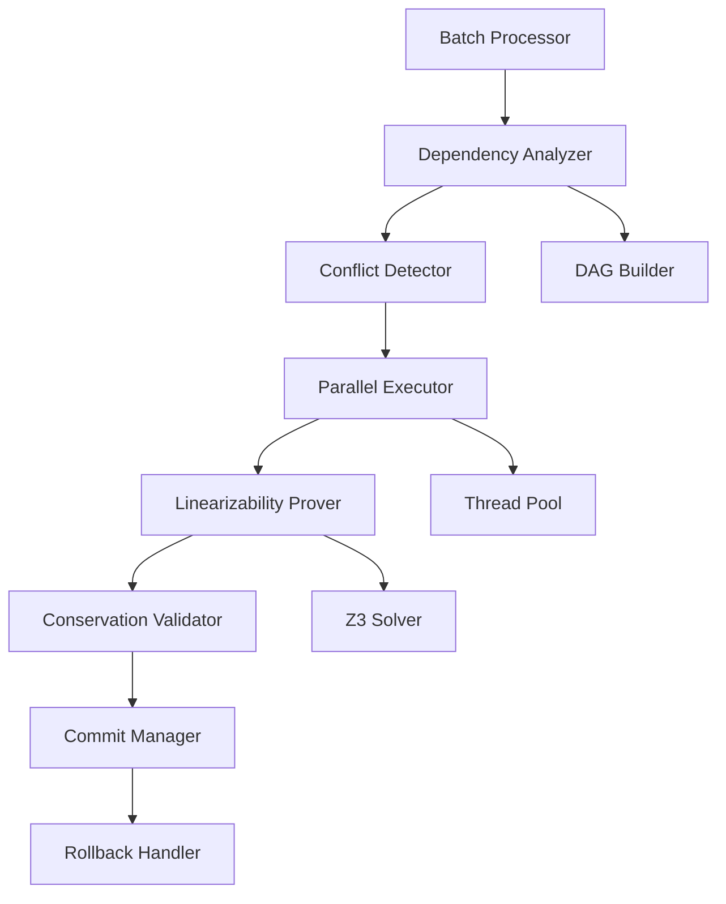

# Design Document: Synchrony Protocol v1.8.0

## Overview

The Synchrony Protocol introduces parallel transaction processing to Aethel while maintaining mathematical correctness guarantees. The system analyzes transaction dependencies, executes independent transactions concurrently, and generates formal proofs that parallel execution is equivalent to serial execution.

The design follows an optimistic concurrency control approach where transactions are analyzed for conflicts before execution, then executed in parallel where safe, with Z3-based verification that the parallel schedule is conflict-serializable.

**Key Innovation**: Rather than using traditional locking mechanisms, we build a precedence graph (dependency DAG) and prove that the parallel execution order is equivalent to some valid serial order using SMT solving.

## Architecture

### High-Level Flow

```
Batch Submission
    ↓
Dependency Analysis (Build DAG)
    ↓
Conflict Detection (RAW/WAW)
    ↓
Parallel Execution (Thread Pool)
    ↓
Linearizability Proof (Z3)
    ↓
Conservation Validation
    ↓
Atomic Commit/Rollback
```

### Component Diagram



## Components and Interfaces

### 1. Batch Processor

**Responsibility**: Entry point for batch transaction processing.

**Interface**:
```python
class BatchProcessor:
    def execute_batch(self, transactions: List[Transaction]) -> BatchResult:
        """
        Execute a batch of transactions with parallel optimization.
        
        Args:
            transactions: List of transactions to execute
            
        Returns:
            BatchResult containing execution status, proofs, and metrics
        """
        pass
    
    def execute_atomic_batch(self, batch_ast: AtomicBatchNode) -> BatchResult:
        """
        Execute an atomic_batch from parsed Aethel code.
        
        Args:
            batch_ast: Parsed atomic_batch AST node
            
        Returns:
            BatchResult containing execution status, proofs, and metrics
        """
        pass
```

### 2. Dependency Analyzer

**Responsibility**: Analyze transaction dependencies and build a directed acyclic graph (DAG).

**Algorithm**: For each pair of transactions (Ti, Tj), add edge Ti → Tj if:
- Ti writes to account A and Tj reads from account A (RAW dependency)
- Ti writes to account A and Tj writes to account A (WAW dependency)
- Ti reads from account A and Tj writes to account A (WAR dependency)

**Interface**:
```python
class DependencyAnalyzer:
    def analyze(self, transactions: List[Transaction]) -> DependencyGraph:
        """
        Analyze dependencies between transactions.
        
        Args:
            transactions: List of transactions to analyze
            
        Returns:
            DependencyGraph representing transaction dependencies
            
        Raises:
            CircularDependencyError: If a cycle is detected
        """
        pass
    
    def extract_read_write_sets(self, transaction: Transaction) -> Tuple[Set[str], Set[str]]:
        """
        Extract read and write sets from a transaction.
        
        Args:
            transaction: Transaction to analyze
            
        Returns:
            Tuple of (read_set, write_set) containing account identifiers
        """
        pass
```

**Data Structure**:
```python
class DependencyGraph:
    nodes: Dict[str, TransactionNode]  # transaction_id -> node
    edges: List[Tuple[str, str]]       # (from_id, to_id)
    
    def has_cycle(self) -> bool:
        """Check if graph contains a cycle using DFS."""
        pass
    
    def topological_sort(self) -> List[str]:
        """Return topologically sorted transaction IDs."""
        pass
    
    def get_independent_sets(self) -> List[Set[str]]:
        """
        Return sets of transactions that can execute in parallel.
        Uses level-order traversal of DAG.
        """
        pass
```

### 3. Conflict Detector

**Responsibility**: Detect and classify conflicts between transactions.

**Conflict Types**:
- **RAW (Read-After-Write)**: T1 writes X, T2 reads X
- **WAW (Write-After-Write)**: T1 writes X, T2 writes X  
- **WAR (Write-After-Read)**: T1 reads X, T2 writes X

**Interface**:
```python
class ConflictDetector:
    def detect_conflicts(self, 
                        transactions: List[Transaction],
                        dependency_graph: DependencyGraph) -> List[Conflict]:
        """
        Detect all conflicts between transactions.
        
        Args:
            transactions: List of transactions
            dependency_graph: Dependency graph from analyzer
            
        Returns:
            List of detected conflicts with types and involved transactions
        """
        pass
    
    def resolve_conflicts(self, conflicts: List[Conflict]) -> ResolutionStrategy:
        """
        Determine resolution strategy for conflicts.
        
        Args:
            conflicts: List of detected conflicts
            
        Returns:
            ResolutionStrategy specifying execution order
        """
        pass
```

**Data Structure**:
```python
class Conflict:
    type: ConflictType  # RAW, WAW, WAR
    transaction_1: str  # First transaction ID
    transaction_2: str  # Second transaction ID
    resource: str       # Conflicting account/resource
    resolution: str     # "enforce_order" or "serialize"
```

### 4. Parallel Executor

**Responsibility**: Execute independent transactions in parallel using a thread pool.

**Execution Strategy**:
1. Get independent sets from dependency graph (level-order traversal)
2. For each independent set:
   - Execute all transactions in parallel using thread pool
   - Wait for all to complete before proceeding to next set
3. Maintain execution order within dependency chains

**Interface**:
```python
class ParallelExecutor:
    def __init__(self, num_threads: int = 8):
        self.thread_pool = ThreadPoolExecutor(max_workers=num_threads)
        self.timeout_seconds = 300  # 5 minutes default
    
    def execute_parallel(self, 
                        transactions: List[Transaction],
                        dependency_graph: DependencyGraph) -> ExecutionResult:
        """
        Execute transactions in parallel respecting dependencies.
        
        Args:
            transactions: List of transactions to execute
            dependency_graph: Dependency graph specifying execution order
            
        Returns:
            ExecutionResult containing final states and execution trace
            
        Raises:
            TimeoutError: If execution exceeds timeout
            ExecutionError: If any transaction fails
        """
        pass
    
    def execute_independent_set(self, 
                               transaction_ids: Set[str],
                               transactions: Dict[str, Transaction]) -> Dict[str, TransactionResult]:
        """
        Execute a set of independent transactions in parallel.
        
        Args:
            transaction_ids: Set of transaction IDs to execute
            transactions: Map of transaction ID to Transaction
            
        Returns:
            Map of transaction ID to execution result
        """
        pass
```

**Data Structure**:
```python
class ExecutionResult:
    final_states: Dict[str, AccountState]  # account_id -> final state
    execution_trace: List[ExecutionEvent]  # Ordered list of events
    parallel_groups: List[Set[str]]        # Groups executed in parallel
    execution_time: float                  # Total execution time in seconds
    thread_count: int                      # Number of threads used
```

### 5. Linearizability Prover

**Responsibility**: Generate Z3 proof that parallel execution is equivalent to some serial execution.

**Proof Strategy**:
1. Encode parallel execution as SMT constraints
2. Encode all possible serial executions as SMT constraints
3. Prove: ∃ serial_order such that parallel_result = serial_result
4. If proof fails, extract counterexample from Z3

**Interface**:
```python
class LinearizabilityProver:
    def __init__(self):
        self.solver = z3.Solver()
    
    def prove_linearizability(self, 
                             execution_result: ExecutionResult,
                             transactions: List[Transaction]) -> ProofResult:
        """
        Prove that parallel execution is linearizable.
        
        Args:
            execution_result: Result from parallel execution
            transactions: Original transactions
            
        Returns:
            ProofResult containing proof or counterexample
        """
        pass
    
    def encode_execution(self, 
                        execution_result: ExecutionResult) -> List[z3.BoolRef]:
        """
        Encode execution result as Z3 constraints.
        
        Args:
            execution_result: Execution result to encode
            
        Returns:
            List of Z3 boolean constraints
        """
        pass
    
    def find_serial_order(self, 
                         transactions: List[Transaction]) -> Optional[List[str]]:
        """
        Find a valid serial order equivalent to parallel execution.
        
        Args:
            transactions: List of transactions
            
        Returns:
            Serial order if exists, None otherwise
        """
        pass
```

**SMT Encoding**:
```python
# For each transaction Ti, create variables:
# - start_time[Ti]: When Ti started
# - end_time[Ti]: When Ti completed
# - state_before[Ti][account]: Account state before Ti
# - state_after[Ti][account]: Account state after Ti

# Constraints:
# 1. Dependency order: If Ti → Tj in DAG, then end_time[Ti] < start_time[Tj]
# 2. State consistency: state_after[Ti][A] = state_before[Tj][A] if Ti → Tj and both access A
# 3. Conservation: sum(state_after[Ti][all_accounts]) = sum(state_before[Ti][all_accounts])
# 4. Linearizability: ∃ serial_order such that results match
```

**Data Structure**:
```python
class ProofResult:
    is_linearizable: bool
    serial_order: Optional[List[str]]  # Equivalent serial order if linearizable
    proof: Optional[str]               # Z3 proof if linearizable
    counterexample: Optional[Dict]     # Counterexample if not linearizable
    proof_time: float                  # Time to generate proof in seconds
```

### 6. Conservation Validator

**Responsibility**: Validate conservation globally across the entire batch.

**Validation Strategy**:
1. Sum all account balances before batch execution
2. Sum all account balances after batch execution
3. Verify: total_before = total_after
4. Use Z3 to prove conservation holds for all possible interleavings

**Interface**:
```python
class ConservationValidator:
    def validate_batch_conservation(self, 
                                   execution_result: ExecutionResult,
                                   initial_states: Dict[str, AccountState]) -> ConservationResult:
        """
        Validate conservation across entire batch.
        
        Args:
            execution_result: Result from parallel execution
            initial_states: Initial account states before batch
            
        Returns:
            ConservationResult indicating if conservation holds
        """
        pass
    
    def prove_conservation_invariant(self, 
                                    transactions: List[Transaction]) -> ProofResult:
        """
        Prove that conservation holds for all possible execution orders.
        
        Args:
            transactions: List of transactions in batch
            
        Returns:
            ProofResult containing conservation proof
        """
        pass
```

### 7. Commit Manager

**Responsibility**: Atomically commit or rollback all transactions in batch.

**Commit Protocol**:
1. If all transactions succeed AND linearizability proof succeeds AND conservation holds:
   - Commit all state changes atomically
2. Otherwise:
   - Rollback all state changes
   - Return detailed error information

**Interface**:
```python
class CommitManager:
    def commit_batch(self, 
                    execution_result: ExecutionResult,
                    proof_result: ProofResult,
                    conservation_result: ConservationResult) -> CommitResult:
        """
        Atomically commit or rollback batch.
        
        Args:
            execution_result: Result from parallel execution
            proof_result: Linearizability proof result
            conservation_result: Conservation validation result
            
        Returns:
            CommitResult indicating success or failure with details
        """
        pass
    
    def rollback_batch(self, 
                      execution_result: ExecutionResult,
                      initial_states: Dict[str, AccountState]) -> None:
        """
        Rollback all state changes from batch.
        
        Args:
            execution_result: Result from parallel execution
            initial_states: Initial states to restore
        """
        pass
```

## Data Models

### Transaction

```python
class Transaction:
    id: str                          # Unique transaction identifier
    intent_name: str                 # Name of the intent being executed
    accounts: Dict[str, Account]     # Accounts involved in transaction
    operations: List[Operation]      # List of operations to perform
    verify_conditions: List[Condition]  # Verification conditions
    oracle_proofs: List[OracleProof]   # Oracle proofs if needed
    
    def get_read_set(self) -> Set[str]:
        """Return set of account IDs read by this transaction."""
        pass
    
    def get_write_set(self) -> Set[str]:
        """Return set of account IDs written by this transaction."""
        pass
```

### AtomicBatchNode

```python
class AtomicBatchNode:
    """AST node representing an atomic_batch block in Aethel code."""
    intents: List[IntentNode]  # List of intent definitions
    location: SourceLocation   # Source code location
    
    def to_transactions(self) -> List[Transaction]:
        """Convert intents to executable transactions."""
        pass
```

### BatchResult

```python
class BatchResult:
    success: bool
    transactions_executed: int
    transactions_parallel: int
    execution_time: float
    throughput_improvement: float  # Ratio vs serial execution
    
    # Proof artifacts
    linearizability_proof: Optional[ProofResult]
    conservation_proof: Optional[ConservationResult]
    
    # Execution details
    execution_trace: List[ExecutionEvent]
    parallel_groups: List[Set[str]]
    conflicts_detected: List[Conflict]
    
    # Performance metrics
    thread_count: int
    avg_parallelism: float  # Average number of concurrent transactions
    
    # Error information (if failed)
    error_message: Optional[str]
    failed_transaction: Optional[str]
    counterexample: Optional[Dict]
```

### DependencyGraph

```python
class DependencyGraph:
    """Directed acyclic graph representing transaction dependencies."""
    nodes: Dict[str, TransactionNode]
    edges: List[Tuple[str, str]]  # (from_id, to_id)
    
    def has_cycle(self) -> bool:
        """Check for cycles using DFS."""
        visited = set()
        rec_stack = set()
        
        def dfs(node_id: str) -> bool:
            visited.add(node_id)
            rec_stack.add(node_id)
            
            for neighbor in self.get_neighbors(node_id):
                if neighbor not in visited:
                    if dfs(neighbor):
                        return True
                elif neighbor in rec_stack:
                    return True
            
            rec_stack.remove(node_id)
            return False
        
        for node_id in self.nodes:
            if node_id not in visited:
                if dfs(node_id):
                    return True
        return False
    
    def topological_sort(self) -> List[str]:
        """Return topologically sorted transaction IDs using Kahn's algorithm."""
        pass
    
    def get_independent_sets(self) -> List[Set[str]]:
        """
        Return sets of transactions that can execute in parallel.
        Uses level-order traversal: transactions at same level are independent.
        """
        pass
```

### ExecutionEvent

```python
class ExecutionEvent:
    """Represents a single event in the execution trace."""
    timestamp: float
    transaction_id: str
    event_type: EventType  # START, READ, WRITE, COMMIT, ROLLBACK
    account_id: Optional[str]
    old_value: Optional[int]
    new_value: Optional[int]
    thread_id: int
```

## Correctness Properties

*A property is a characteristic or behavior that should hold true across all valid executions of a system—essentially, a formal statement about what the system should do. Properties serve as the bridge between human-readable specifications and machine-verifiable correctness guarantees.*

Now I need to perform prework analysis on the acceptance criteria to determine which are testable as properties:


### Property Reflection

After analyzing all acceptance criteria, I identified several areas where properties can be consolidated:

**Consolidation Opportunities:**
1. Properties 1.2 and 1.3 (independent/dependent classification) can be combined into one comprehensive property about dependency classification correctness
2. Properties 5.1 and 5.2 (RAW/WAW conflict detection) can be combined into one property about conflict detection completeness
3. Properties 7.1-7.5 (metrics collection) can be combined into one property about metrics completeness
4. Properties 3.1, 3.2, and 3.5 (atomicity) can be combined into one comprehensive atomicity property
5. Properties 4.1 and 4.4 (proof generation and inclusion) can be combined
6. Properties 9.1-9.5 (error reporting) can be combined into one property about error message completeness

**Redundancy Elimination:**
- Property 4.5 (invariant preservation) is subsumed by properties 3.3 (conservation) and 4.2 (linearizability)
- Property 6.4 (dependency analysis on atomic_batch) is subsumed by property 1.1 (dependency analysis on all batches)
- Property 8.5 (preserve existing guarantees) is subsumed by property 8.2 (all existing tests pass)

After reflection, we have approximately 25 unique, non-redundant properties to implement.

### Correctness Properties

**Property 1: Dependency Classification Correctness**
*For any* pair of transactions T1 and T2, if they access disjoint sets of accounts, they SHALL be classified as independent; if they access overlapping accounts, they SHALL be classified as dependent.
**Validates: Requirements 1.2, 1.3**

**Property 2: DAG Construction Validity**
*For any* batch of transactions, the dependency graph SHALL be a valid directed acyclic graph where nodes represent transactions and edges represent dependencies.
**Validates: Requirements 1.4**

**Property 3: Circular Dependency Rejection**
*For any* batch of transactions that would create a circular dependency, the system SHALL reject the batch with an error identifying the cycle.
**Validates: Requirements 1.5, 10.1, 10.2**

**Property 4: Parallel Execution of Independent Transactions**
*For any* batch containing independent transactions, those transactions SHALL execute concurrently (overlapping execution times in the trace).
**Validates: Requirements 2.1**

**Property 5: Dependency Order Preservation**
*For any* batch with dependent transactions T1 → T2, the execution trace SHALL show T1 completing before T2 starts.
**Validates: Requirements 2.2**

**Property 6: Thread Safety Invariant**
*For any* parallel execution, no two threads SHALL simultaneously modify the same account state without synchronization.
**Validates: Requirements 2.3**

**Property 7: Batch Atomicity**
*For any* batch of transactions, either all transactions SHALL commit and all state changes persist, or all transactions SHALL rollback and all states restore to pre-batch values.
**Validates: Requirements 3.1, 3.2, 3.5**

**Property 8: Conservation Across Batch**
*For any* batch execution, the sum of all account balances before the batch SHALL equal the sum of all account balances after the batch.
**Validates: Requirements 3.3**

**Property 9: Oracle Validation Before Commit**
*For any* batch containing transactions with oracle proofs, all oracle proofs SHALL be validated before any transaction commits.
**Validates: Requirements 3.4**

**Property 10: Linearizability Equivalence**
*For any* parallel batch execution, there SHALL exist a valid serial execution order that produces identical final states for all accounts.
**Validates: Requirements 4.2**

**Property 11: Linearizability Proof Generation**
*For any* successful parallel batch execution, the result SHALL include a Z3-generated proof of linearizability.
**Validates: Requirements 4.1, 4.4**

**Property 12: Counterexample on Proof Failure**
*For any* batch where linearizability cannot be proven, the system SHALL return a Z3-generated counterexample demonstrating the violation.
**Validates: Requirements 4.3**

**Property 13: Conflict Detection Completeness**
*For any* pair of transactions that both access account A, where at least one writes to A, the system SHALL detect and report a conflict (RAW, WAW, or WAR).
**Validates: Requirements 5.1, 5.2**

**Property 14: Conflict Resolution Determinism**
*For any* batch of transactions, executing the batch multiple times SHALL produce identical results (same final states, same execution order for dependent transactions).
**Validates: Requirements 5.4**

**Property 15: Conflict Reporting Completeness**
*For any* batch execution, all detected conflicts SHALL be included in the batch result.
**Validates: Requirements 5.5**

**Property 16: Atomic Batch Parsing Completeness**
*For any* valid atomic_batch block, parsing SHALL extract all contained intents with their complete definitions.
**Validates: Requirements 6.2**

**Property 17: Atomic Batch Name Uniqueness**
*For any* atomic_batch block with duplicate intent names, the system SHALL reject it with a validation error.
**Validates: Requirements 6.3**

**Property 18: Atomic Batch Semantic Equivalence**
*For any* set of transactions, executing them via atomic_batch syntax SHALL produce identical results to executing them via programmatic batch submission.
**Validates: Requirements 6.5**

**Property 19: Performance Metrics Completeness**
*For any* batch execution, the result SHALL include execution time, parallel transaction count, thread count, and throughput improvement ratio.
**Validates: Requirements 7.1, 7.2, 7.3, 7.4, 7.5**

**Property 20: Single Transaction Backward Compatibility**
*For any* single transaction, executing it in v1.8.0 SHALL produce identical results to executing it in v1.7.0.
**Validates: Requirements 8.1, 8.3**

**Property 21: API Contract Preservation**
*For any* existing API call for transaction submission or result retrieval, the v1.8.0 API SHALL accept the same inputs and return compatible outputs as v1.7.0.
**Validates: Requirements 8.4**

**Property 22: Error Message Completeness**
*For any* error condition (circular dependency, proof failure, transaction failure, unresolvable conflict), the error response SHALL include detailed diagnostic information identifying the problem.
**Validates: Requirements 9.1, 9.2, 9.3, 9.4, 9.5**

**Property 23: Timeout Detection and Rollback**
*For any* batch execution that exceeds the configured timeout, the system SHALL rollback all transactions and return a timeout error.
**Validates: Requirements 10.3, 10.4**

**Property 24: Timeout Configuration Validity**
*For any* batch, the configured timeout SHALL be at least 10x the average serial execution time for that batch size.
**Validates: Requirements 10.5**

**Property 25: Dependency Analysis Completeness**
*For any* batch of transactions, the dependency analysis SHALL identify all read-after-write, write-after-write, and write-after-read dependencies.
**Validates: Requirements 1.1, 5.3**

## Error Handling

### Error Types

1. **CircularDependencyError**
   - Raised when: Dependency graph contains a cycle
   - Information: List of transaction IDs forming the cycle
   - Recovery: User must modify transactions to break the cycle

2. **LinearizabilityError**
   - Raised when: No valid serial order exists for parallel execution
   - Information: Z3 counterexample showing the violation
   - Recovery: System automatically falls back to serial execution

3. **ConservationViolationError**
   - Raised when: Total balance changes across batch
   - Information: Expected vs actual totals, violating transactions
   - Recovery: Batch is rolled back, user must fix transactions

4. **TimeoutError**
   - Raised when: Batch execution exceeds timeout
   - Information: Timeout duration, transactions completed, transactions pending
   - Recovery: Batch is rolled back, user can retry with smaller batch

5. **ConflictResolutionError**
   - Raised when: Conflicts cannot be resolved deterministically
   - Information: Conflicting transactions, conflict types
   - Recovery: User must modify transactions to remove conflicts

6. **OracleValidationError**
   - Raised when: Oracle proof validation fails
   - Information: Failed proof details, expected vs actual values
   - Recovery: Batch is rolled back, user must provide valid oracle proofs

### Error Handling Strategy

```python
def execute_batch_with_error_handling(transactions: List[Transaction]) -> BatchResult:
    """Execute batch with comprehensive error handling."""
    initial_states = capture_initial_states()
    
    try:
        # Phase 1: Dependency Analysis
        dependency_graph = analyze_dependencies(transactions)
        if dependency_graph.has_cycle():
            cycle = dependency_graph.find_cycle()
            raise CircularDependencyError(cycle)
        
        # Phase 2: Conflict Detection
        conflicts = detect_conflicts(transactions, dependency_graph)
        
        # Phase 3: Parallel Execution
        execution_result = execute_parallel(transactions, dependency_graph)
        
        # Phase 4: Linearizability Proof
        proof_result = prove_linearizability(execution_result, transactions)
        if not proof_result.is_linearizable:
            raise LinearizabilityError(proof_result.counterexample)
        
        # Phase 5: Conservation Validation
        conservation_result = validate_conservation(execution_result, initial_states)
        if not conservation_result.is_valid:
            raise ConservationViolationError(conservation_result.details)
        
        # Phase 6: Oracle Validation
        oracle_result = validate_oracle_proofs(transactions)
        if not oracle_result.is_valid:
            raise OracleValidationError(oracle_result.details)
        
        # Phase 7: Atomic Commit
        commit_result = commit_batch(execution_result)
        return BatchResult(success=True, ...)
        
    except (CircularDependencyError, LinearizabilityError, 
            ConservationViolationError, TimeoutError,
            ConflictResolutionError, OracleValidationError) as e:
        # Rollback all changes
        rollback_batch(initial_states)
        return BatchResult(
            success=False,
            error_message=str(e),
            error_type=type(e).__name__,
            diagnostic_info=e.get_diagnostics()
        )
```

### Fallback Strategy

If parallel execution fails linearizability proof:
1. Log the failure and counterexample
2. Fall back to serial execution automatically
3. Return result with warning about fallback
4. Include performance comparison (parallel attempt vs serial success)

This ensures the system always produces correct results, even if parallel optimization fails.

## Testing Strategy

### Dual Testing Approach

The Synchrony Protocol requires both unit tests and property-based tests for comprehensive coverage:

**Unit Tests**: Focus on specific examples, edge cases, and integration points
- Example: Test a specific batch with known dependencies
- Example: Test circular dependency detection with a 3-transaction cycle
- Example: Test timeout handling with a deliberately slow transaction
- Edge case: Empty batch
- Edge case: Single transaction batch
- Edge case: Batch with all independent transactions
- Edge case: Batch with fully serial dependencies

**Property-Based Tests**: Verify universal properties across all inputs
- Generate random batches with varying sizes (1-100 transactions)
- Generate random account access patterns
- Generate random transaction operations
- Verify properties hold for all generated inputs
- Minimum 100 iterations per property test

### Property-Based Testing Configuration

**Library**: Use Hypothesis (Python) for property-based testing
- Hypothesis provides excellent support for generating complex data structures
- Integrates well with pytest
- Provides automatic shrinking of failing examples

**Test Configuration**:
```python
from hypothesis import given, settings, strategies as st

@settings(max_examples=100, deadline=None)
@given(
    transactions=st.lists(
        st.builds(Transaction, ...),
        min_size=1,
        max_size=100
    )
)
def test_property_N(transactions):
    """
    Feature: synchrony-protocol, Property N: [Property text]
    """
    # Test implementation
    pass
```

**Tag Format**: Each property test MUST include a docstring with:
```
Feature: synchrony-protocol, Property {number}: {property_text}
```

### Test Organization

```
tests/
├── unit/
│   ├── test_dependency_analyzer.py
│   ├── test_conflict_detector.py
│   ├── test_parallel_executor.py
│   ├── test_linearizability_prover.py
│   ├── test_conservation_validator.py
│   └── test_commit_manager.py
├── property/
│   ├── test_properties_dependency.py      # Properties 1-3, 25
│   ├── test_properties_execution.py       # Properties 4-6
│   ├── test_properties_atomicity.py       # Properties 7-9
│   ├── test_properties_linearizability.py # Properties 10-12
│   ├── test_properties_conflicts.py       # Properties 13-15
│   ├── test_properties_syntax.py          # Properties 16-18
│   ├── test_properties_metrics.py         # Properties 19
│   ├── test_properties_compatibility.py   # Properties 20-21
│   └── test_properties_errors.py          # Properties 22-24
└── integration/
    ├── test_batch_end_to_end.py
    ├── test_atomic_batch_syntax.py
    └── test_backward_compatibility.py
```

### Critical Test Scenarios

1. **DeFi Exchange Simulation**: 10,000 independent trades
2. **Payroll Processing**: 10,000 employee payments
3. **Liquidation Engine**: 1,000 simultaneous liquidations
4. **Mixed Dependencies**: Batch with both independent and dependent transactions
5. **Stress Test**: Maximum parallelism (100 independent transactions, 8 threads)
6. **Regression Test**: All 48 existing v1.7.0 tests must pass

### Performance Benchmarks

While not correctness properties, these benchmarks validate the performance requirements:

1. **Throughput Test**: Measure transactions/second for batches of size 10, 100, 1000
2. **Scalability Test**: Measure speedup with 1, 2, 4, 8 threads
3. **Latency Test**: Measure individual transaction latency overhead
4. **Comparison Test**: Compare parallel vs serial execution time

Target: 10x throughput improvement for 100+ independent transactions

## Implementation Notes

### Thread Pool Configuration

- Default: 8 threads (matches typical CPU core count)
- Configurable via environment variable: `AETHEL_THREAD_POOL_SIZE`
- Minimum: 2 threads
- Maximum: 16 threads (diminishing returns beyond this)

### Z3 Solver Configuration

- Timeout: 30 seconds per proof attempt
- Tactics: Use QF_LIA (quantifier-free linear integer arithmetic)
- Optimization: Cache common proof patterns
- Fallback: If proof times out, fall back to serial execution

### State Management

- Use copy-on-write for account states during parallel execution
- Each thread operates on isolated state copies
- Merge states after successful execution
- Discard states on rollback

### Dependency Analysis Optimization

- Cache read/write sets for each transaction
- Use hash sets for O(1) intersection checks
- Early exit on first dependency found for each pair
- Parallelize dependency analysis itself (analyze pairs in parallel)

### Monitoring and Observability

- Log all batch executions with timing information
- Track parallel efficiency (actual parallelism vs theoretical maximum)
- Alert on frequent linearizability proof failures
- Dashboard showing throughput improvements over time

## Migration Path

### Phase 1: Internal Testing (Week 1-2)
- Implement core components
- Run property-based tests
- Validate against existing test suite
- Performance benchmarking

### Phase 2: Opt-In Beta (Week 3-4)
- Release as opt-in feature flag: `AETHEL_ENABLE_PARALLEL=true`
- Monitor production usage
- Collect performance metrics
- Fix any discovered issues

### Phase 3: Default Enabled (Week 5-6)
- Enable by default for all users
- Provide opt-out flag: `AETHEL_ENABLE_PARALLEL=false`
- Monitor for regressions
- Optimize based on real-world usage patterns

### Phase 4: Mandatory (Week 7+)
- Remove serial-only mode
- Parallel execution becomes the only mode
- Full documentation and examples
- Performance tuning and optimization

## Future Enhancements

### v1.9.0: Speculative Execution
- Execute transactions speculatively before dependency analysis completes
- Rollback speculative execution if dependencies detected
- Further reduce latency for independent transactions

### v2.0.0: Distributed Parallel Execution
- Distribute batch execution across multiple machines
- Use distributed consensus for commit protocol
- Scale beyond single-machine thread limits

### v2.1.0: Adaptive Parallelism
- Machine learning model to predict optimal thread count
- Dynamic adjustment based on batch characteristics
- Automatic fallback to serial for small batches

### v2.2.0: GPU Acceleration
- Offload Z3 proof generation to GPU
- Parallel state merging on GPU
- 100x throughput improvement target
