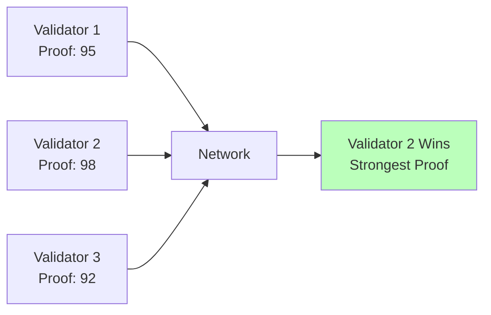
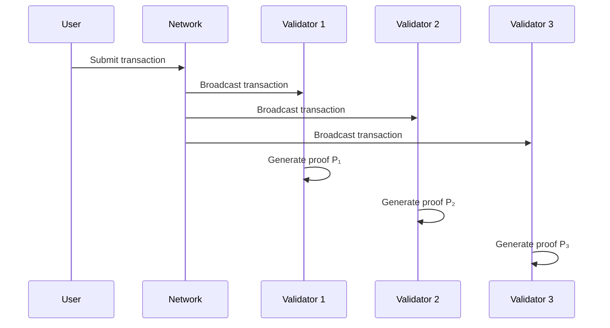
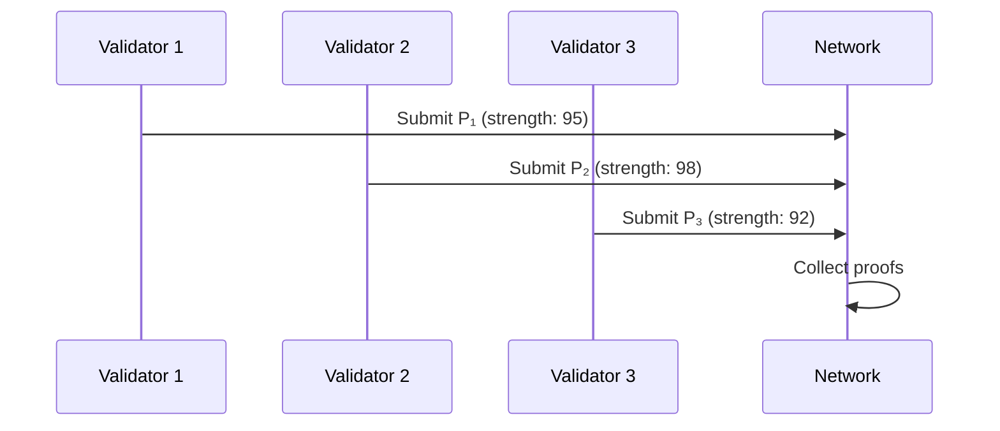
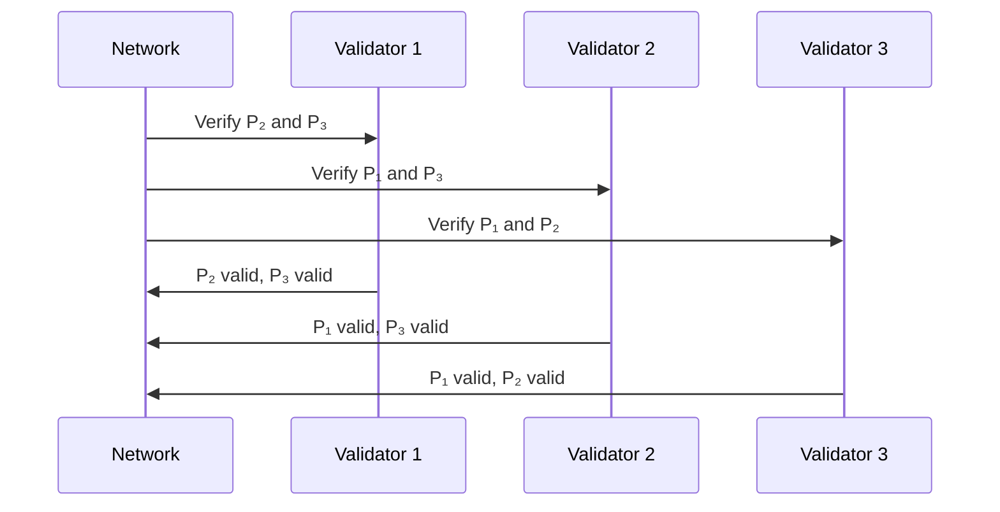
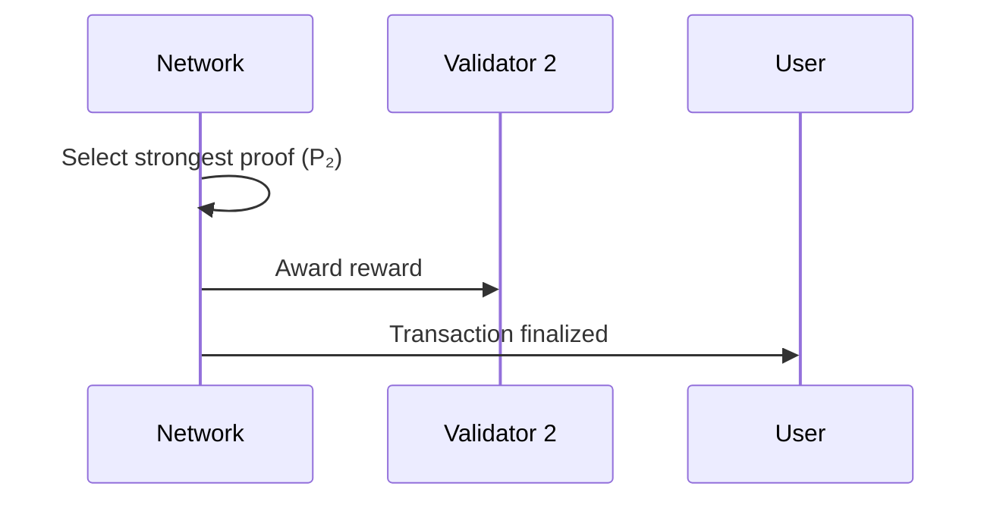
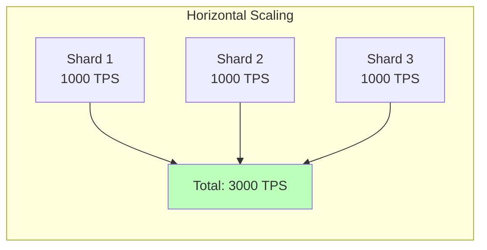

# Proof-of-Proof Consensus

## Overview

Proof-of-Proof (PoP) is Aethel's consensus mechanism for distributed financial systems. Instead of mining or staking, validators prove the correctness of financial transactions using mathematical proofs.

## Motivation

Traditional consensus mechanisms have limitations for financial systems:

**Proof-of-Work (PoW)**:
- Energy intensive
- Slow finality
- No correctness guarantees

**Proof-of-Stake (PoS)**:
- Economic security only
- No correctness guarantees
- Vulnerable to economic attacks

**Proof-of-Proof (PoP)**:
- Mathematical security
- Fast finality
- Correctness guarantees
- Energy efficient

## Core Concept

In PoP, validators compete to generate the best mathematical proof of transaction correctness. The network accepts the transaction with the strongest proof.

### Key Insight

**Traditional**: "This transaction is valid because I have economic stake"  
**Proof-of-Proof**: "This transaction is valid because I have a mathematical proof"

## How It Works

### 1. Transaction Submission

User submits an Aethel program:

```aethel
solve transfer {
    alice = 1000
    bob = 500
    
    alice = alice - 100
    bob = bob + 100
    
    conserve alice + bob == 1500
}
```

### 2. Proof Generation

Validators generate proofs:

```
Validator 1: Generates proof P₁ (strength: 95)
Validator 2: Generates proof P₂ (strength: 98)
Validator 3: Generates proof P₃ (strength: 92)
```

### 3. Proof Competition

Validators submit proofs to the network:



### 4. Consensus

Network reaches consensus on the strongest proof:

- Validators verify each other's proofs
- Strongest valid proof wins
- Transaction is finalized
- Winner receives reward

## Proof Strength

### What Makes a Proof Strong?

1. **Completeness** - Covers all properties
2. **Depth** - Number of proof steps
3. **Rigor** - Mathematical soundness
4. **Efficiency** - Verification speed

### Proof Strength Formula

```
Strength(P) = Completeness(P) × Depth(P) × Rigor(P) / VerificationTime(P)
```

### Example

```python
# Proof 1: Basic proof
proof1 = {
    "completeness": 0.8,  # Covers 80% of properties
    "depth": 10,          # 10 proof steps
    "rigor": 0.9,         # 90% rigorous
    "verification_time": 0.1  # 100ms
}

strength1 = (0.8 * 10 * 0.9) / 0.1 = 72

# Proof 2: Better proof
proof2 = {
    "completeness": 1.0,  # Covers 100% of properties
    "depth": 15,          # 15 proof steps
    "rigor": 1.0,         # 100% rigorous
    "verification_time": 0.15  # 150ms
}

strength2 = (1.0 * 15 * 1.0) / 0.15 = 100

# Proof 2 wins!
```

## Consensus Protocol

### Phase 1: Proof Generation



### Phase 2: Proof Submission



### Phase 3: Proof Verification



### Phase 4: Consensus



## Security Properties

### 1. Byzantine Fault Tolerance

PoP tolerates up to 1/3 Byzantine validators:

- Malicious validators cannot forge proofs
- Invalid proofs are rejected
- Honest majority ensures correctness

### 2. Finality

Transactions are final once consensus is reached:

- No reorganizations
- No double-spending
- Immediate finality

### 3. Correctness Guarantee

Every finalized transaction has a mathematical proof:

- Constraints verified
- Conservation proven
- Security checked

## Economic Model

### Validator Rewards

Validators earn rewards for generating proofs:

```
Reward = Base_Reward × (Proof_Strength / Max_Strength)
```

**Example**:
```
Base reward: 10 tokens
Proof strength: 98
Max strength: 100

Reward = 10 × (98/100) = 9.8 tokens
```

### Slashing

Validators are slashed for:

1. **Invalid proofs** - Submitting incorrect proofs
2. **Plagiarism** - Copying other validators' proofs
3. **Censorship** - Refusing to validate transactions

### Staking

Validators must stake tokens to participate:

- Minimum stake: 1000 tokens
- Slashed stake goes to treasury
- Stake earns rewards

## Performance

### Throughput

- **Transactions per second**: 1000+
- **Proof generation**: 10-100ms
- **Proof verification**: 1-10ms
- **Consensus time**: 100-500ms

### Latency

- **Transaction submission**: <10ms
- **Proof generation**: 10-100ms
- **Consensus**: 100-500ms
- **Total finality**: 200-600ms

### Scalability



## Comparison with Other Consensus

| Property | PoW | PoS | PoP |
|----------|-----|-----|-----|
| Security | Economic | Economic | Mathematical |
| Finality | Probabilistic | Fast | Immediate |
| Energy | High | Low | Low |
| Correctness | No | No | Yes |
| TPS | 10-100 | 100-1000 | 1000+ |
| Latency | 10-60min | 1-10s | 0.2-0.6s |

## Implementation

### Validator Node

```python
from diotec360.consensus import Validator, ValidatorConfig

# Configure validator
config = ValidatorConfig(
    stake=1000,
    proof_timeout=100,  # 100ms
    verification_threads=4
)

# Create validator
validator = Validator(config)

# Start validating
validator.start()

# Generate proof for transaction
proof = validator.generate_proof(transaction)

# Submit proof to network
validator.submit_proof(proof)
```

### Network Node

```python
from diotec360.consensus import NetworkNode, NetworkConfig

# Configure network node
config = NetworkConfig(
    validators=["validator1", "validator2", "validator3"],
    consensus_threshold=0.67,  # 2/3 majority
    proof_timeout=500  # 500ms
)

# Create network node
node = NetworkNode(config)

# Start node
node.start()

# Submit transaction
result = node.submit_transaction(transaction)

# Wait for finality
node.wait_for_finality(result.tx_id)
```

## Advanced Features

### 1. Proof Caching

Cache proofs for common patterns:

```python
# Cache proof for transfer pattern
cache.store("transfer_pattern", proof)

# Reuse cached proof
cached_proof = cache.get("transfer_pattern")
```

### 2. Parallel Proof Generation

Generate proofs in parallel:

```python
# Generate proofs for multiple transactions
proofs = validator.generate_proofs_parallel([tx1, tx2, tx3])
```

### 3. Proof Compression

Compress proofs for efficiency:

```python
# Compress proof
compressed = compress_proof(proof)

# Decompress for verification
decompressed = decompress_proof(compressed)
```

## Future Enhancements

### 1. Zero-Knowledge Proofs

Integrate ZK proofs for privacy:

```aethel
solve private_transfer {
    # Generate ZK proof
    zkproof = generate_zkproof(transfer)
    
    # Verify without revealing details
    verify_zkproof(zkproof)
}
```

### 2. Recursive Proofs

Prove proofs recursively:

```
Proof of Proof of Proof of ... Transaction
```

### 3. Cross-Chain Proofs

Verify proofs across chains:

```
Chain A → Proof → Chain B
```

## See Also

- [Architecture](../architecture/system-overview.md)
- [Formal Verification](formal-verification.md)
- [Performance Optimization](performance-optimization.md)
- [API Reference](../api-reference/judge.md)

## References

1. **Consensus Mechanisms**: Nakamoto, S. "Bitcoin: A Peer-to-Peer Electronic Cash System"
2. **Byzantine Fault Tolerance**: Castro, M., Liskov, B. "Practical Byzantine Fault Tolerance"
3. **Proof Systems**: Goldwasser, S., et al. "The Knowledge Complexity of Interactive Proof Systems"
