# Diotec360 system Architecture

## Overview

Aethel is a financial programming language with mathematical proof capabilities. This document describes the system architecture, component interactions, and design decisions.

## High-Level Architecture

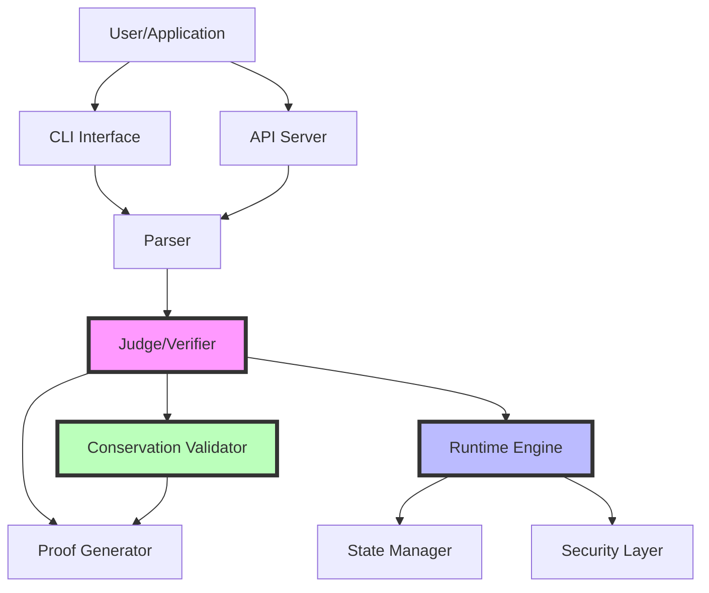

## Core Components

### 1. Parser

**Purpose**: Converts Aethel source code into an Abstract Syntax Tree (AST).

**Responsibilities**:
- Lexical analysis (tokenization)
- Syntax analysis (parsing)
- AST generation
- Syntax error detection

**Input**: Aethel source code (`.ae` files)  
**Output**: Abstract Syntax Tree (AST)

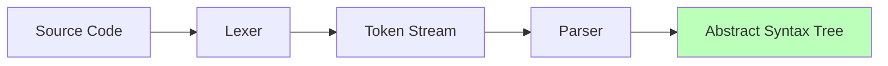

### 2. Judge (Verifier)

**Purpose**: Verifies program correctness and generates mathematical proofs.

**Responsibilities**:
- Constraint verification
- Conservation law checking
- Proof generation
- Security analysis
- Overflow/underflow detection

**Input**: AST  
**Output**: Verification result + Proof

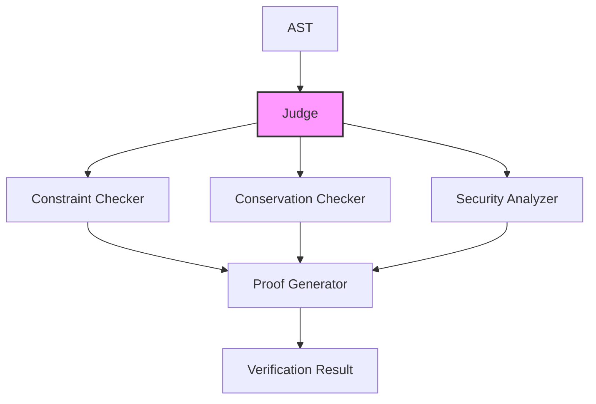

### 3. Runtime Engine

**Purpose**: Executes verified Aethel programs in a safe environment.

**Responsibilities**:
- Program execution
- State management
- Sandboxing
- Resource limits
- Error handling

**Input**: Verified AST  
**Output**: Execution result + Final state

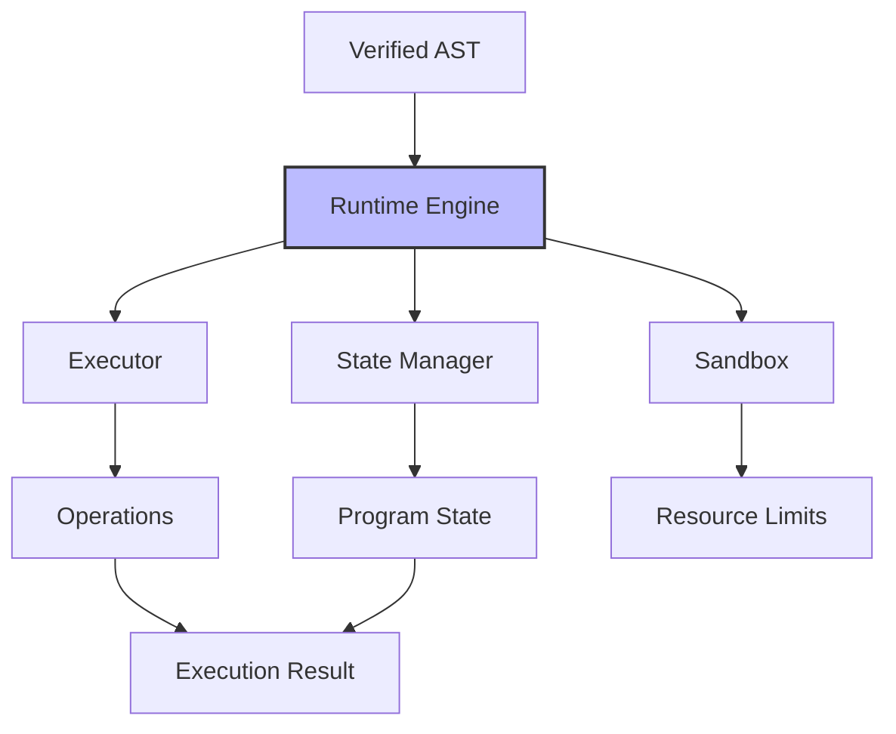

### 4. Conservation Validator

**Purpose**: Verifies that conservation laws hold throughout execution.

**Responsibilities**:
- Conservation checking
- Invariant verification
- Conservation proof generation
- Violation detection

**Input**: Program + Conservation laws  
**Output**: Conservation result + Proof

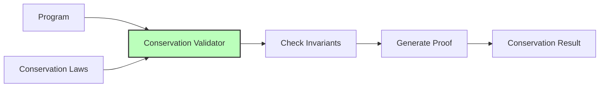

## Data Flow

### Complete Execution Pipeline

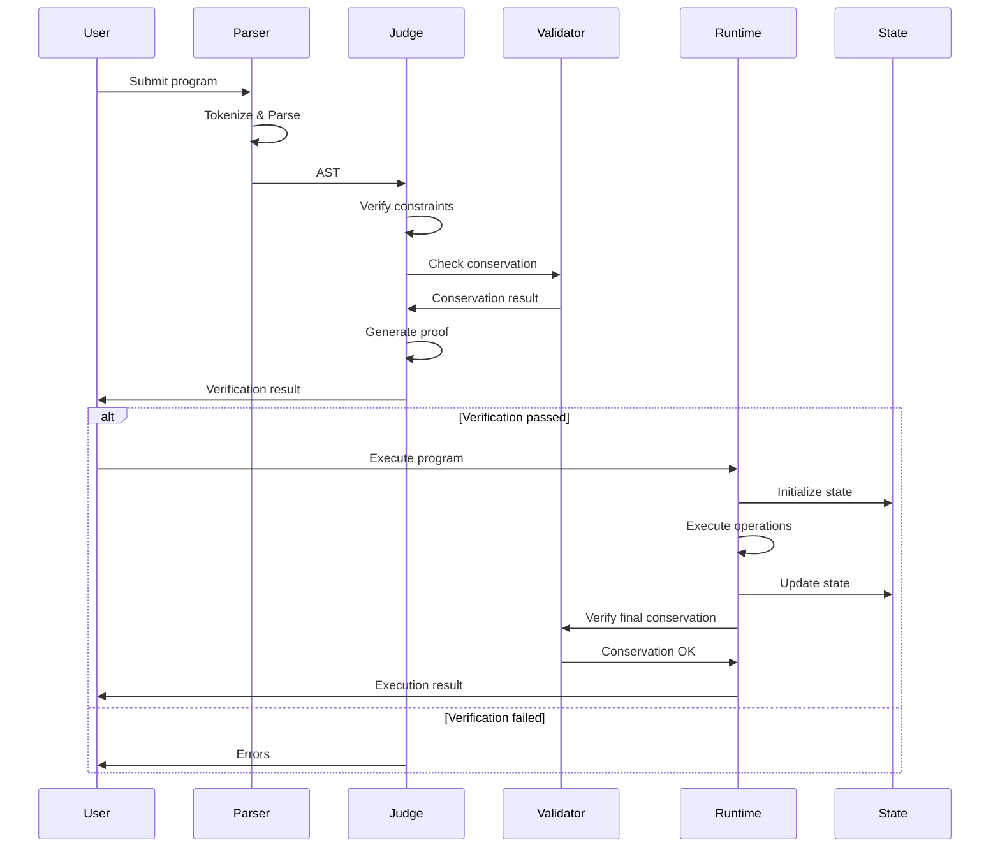

## Component Interactions

### Verification Phase

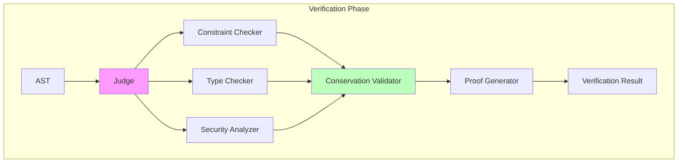

### Execution Phase

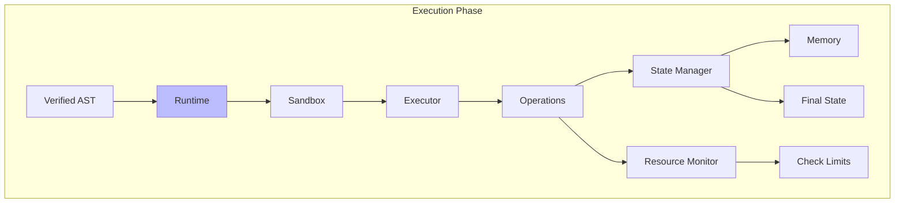

## Security Architecture

### Multi-Layer Security

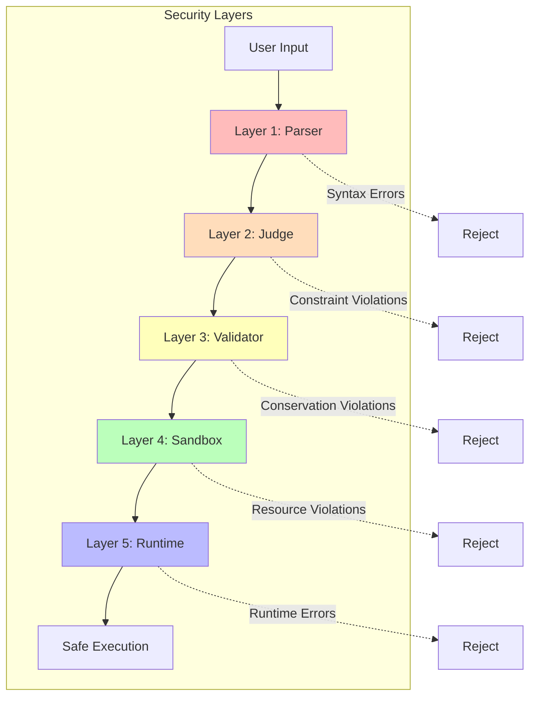

### Sandboxing

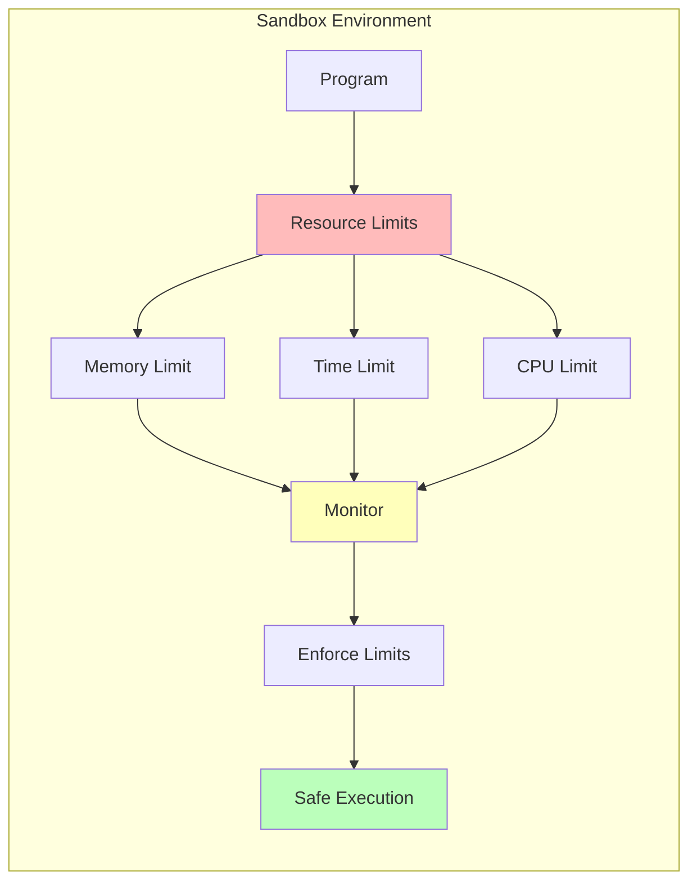

## State Management

### State Lifecycle

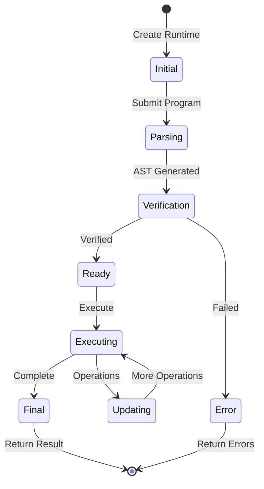

### State Structure

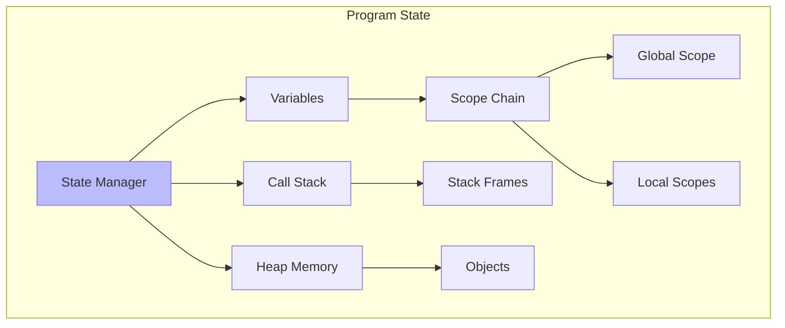

## Proof Generation

### Proof Architecture

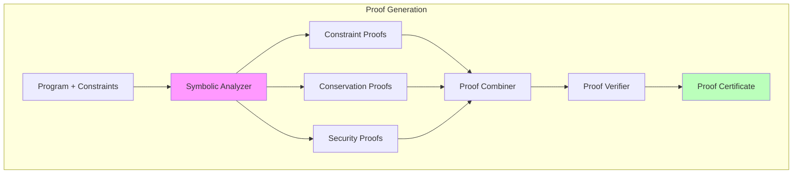

## Design Decisions

### 1. Verification Before Execution

**Decision**: Always verify programs before execution.

**Rationale**:
- Prevents invalid programs from executing
- Catches errors at compile-time
- Generates proofs of correctness
- Provides security guarantees

**Trade-offs**:
- Adds verification overhead (~10-100ms)
- Requires more complex tooling
- Worth it for financial applications

### 2. Immutable State Transitions

**Decision**: State transitions are atomic and immutable.

**Rationale**:
- Easier to reason about program behavior
- Simplifies proof generation
- Enables rollback on errors
- Supports parallel execution

**Trade-offs**:
- Higher memory usage
- Slower for large state
- Acceptable for financial transactions

### 3. Conservation by Default

**Decision**: Conservation laws are checked automatically.

**Rationale**:
- Financial correctness is critical
- Prevents money creation/destruction bugs
- Provides mathematical guarantees
- Builds trust in the system

**Trade-offs**:
- Adds checking overhead (~1-10μs)
- Requires explicit conservation laws
- Essential for financial applications

### 4. Sandboxed Execution

**Decision**: All programs execute in a sandbox.

**Rationale**:
- Prevents resource exhaustion
- Limits attack surface
- Enables safe multi-tenancy
- Provides isolation guarantees

**Trade-offs**:
- Adds execution overhead (~5-10%)
- Limits system access
- Necessary for security

### 5. Proof Certificates

**Decision**: Generate verifiable proof certificates.

**Rationale**:
- Enables independent verification
- Provides audit trail
- Supports compliance requirements
- Builds trust through transparency

**Trade-offs**:
- Increases output size
- Adds generation time
- Critical for trust

## Performance Characteristics

### Typical Latencies

| Operation | Latency | Notes |
|-----------|---------|-------|
| Parse | 1-10ms | Depends on program size |
| Verify | 10-100ms | Depends on complexity |
| Execute | 0.1-10ms | Depends on operations |
| Conservation Check | 1-10μs | Per conserve statement |
| Proof Generation | 10-100ms | Depends on proof complexity |

### Scalability

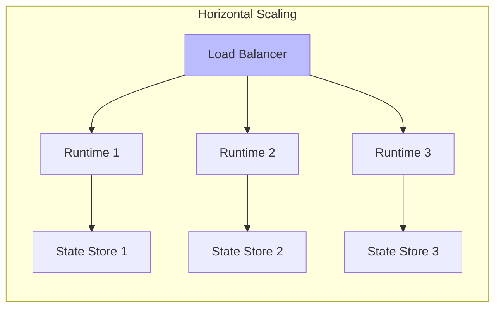

## Extension Points

### Plugin Architecture

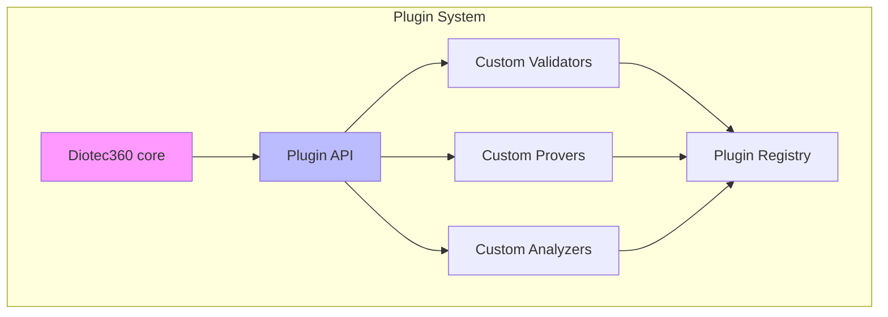

## Deployment Architecture

### Single Node

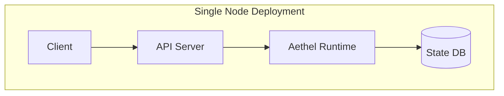

### Distributed

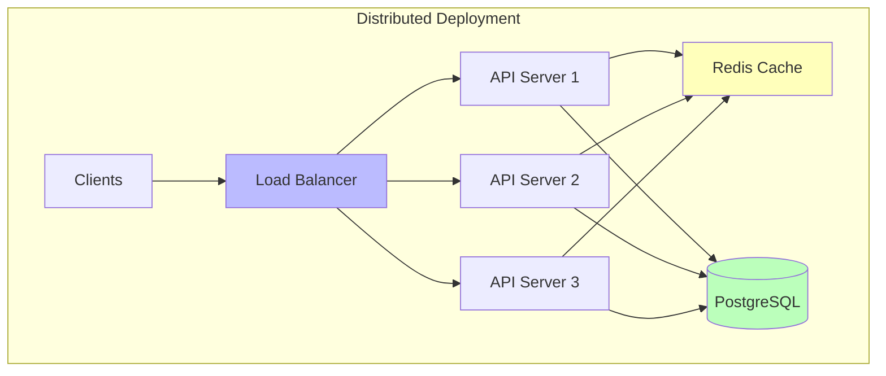

## See Also

- [Getting Started](../getting-started/quickstart.md)
- [API Reference](../api-reference/judge.md)
- [Advanced Topics](../advanced/formal-verification.md)
- [Examples](../examples/banking.md)
